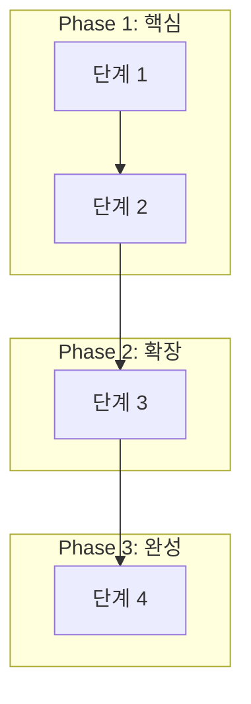

# 1H Agile Phase (How 구조화 + 단계 설정)

## 목적

2W(What/Why)가 명확해진 후, **How(어떻게)를 다이어그램과 Phase로 구조화**하여 일의 방법과 범위를 통제합니다.

**핵심 철학:**
> "일의 방법(How)과 기간(Time)을 알아도 범위(Scope)가 보이지 않으면 불안해진다.
> 모든 업무는 **'다이어그램을 통한 범위의 시각화'**에서 시작하여 주도권을 확보해야 한다."
> — RESUME_RETROSPECTIVE.md

## 전체 파이프라인

```
[2W1H Pipeline]
/2w-brainstorm → What/Why 정리 + (optional) How 초안
        ↓
/1h-agile-phase → 다이어그램(범위) + Phase(단계) + 지표(평가) ← 현재 스킬
        ↓
/sprint-start   → Phase를 Sprint로 변환하여 실행
```

**이 스킬이 통제하는 것:**

| 통제 영역 | 도구 | 효과 |
|----------|------|------|
| **범위 (Scope)** | Mermaid 다이어그램 | 공간 통제 (In/Out/Deferred) |
| **단계 (Phase)** | Phase 분리 | 논리적 실행 순서 |
| **평가 (Metrics)** | 정량/정성 지표 | 완성 기준 |

**참고:** 구체적인 **Sprint 계획(시간 통제)**은 `/sprint-start` 스킬에서 담당합니다.

---

## 공통 출력 규칙 (Quick Guide + Intent/Review/Cleanup)

`how-diagram.md` 초안은 본문 앞에 `Quick Guide`를 포함해 리뷰 기준을 먼저 고정합니다.

**Quick Guide 필수 구성 (최대 8줄, 내용 파악 중심):**
1. 이번 문서의 핵심 결론 1문장
2. 확정된 범위/단계/지표 결정 2~3개
3. 실행에 바로 영향 주는 항목 2~3개
4. 핵심 가정/근거 1~2개
5. 미확정 항목/리스크 1~2개

**Intent/판단 근거 규칙:**
- 범위 확정(In/Out/Deferred)과 Phase 분리는 선택 이유를 1줄로 남깁니다.
- 지표 선택 시 핵심 가정 또는 기준값 근거를 짧게 표시합니다.

**Review/Cleanup 규칙:**
1. 초안에는 Quick Guide와 의도/근거를 포함해 리뷰를 요청합니다.
2. 리뷰 반영 후 최종본에서는 임시 해설 문구를 제거하거나 최소 요약만 남깁니다.
3. 최종 문서는 다이어그램/범위/로드맵/지표 중심으로 정리합니다.

---

## 필수 사전 준비

**이 스킬 실행 전 확인:**
- [ ] `/2w-brainstorm` 완료 (questions.md + 2w-brainstorm.md 존재)
- [ ] What/Why가 명확함
- [ ] 제약 조건 확인됨 (시간/협업/완성도)
- [ ] 대략적 범위 산정됨 (PoC/MVP/Tutorial)

**⚠️ 위 조건이 충족되지 않으면 `/2w-brainstorm`부터 실행!**

---

## 작동 방식 (Workflow)

### Phase 1: 다이어그램 (범위 시각화)

#### 1.1 2W 결과물 읽기

**Step 1: 파일 확인**
- `problems/[문제명]/questions.md` 읽기
- `problems/[문제명]/2w-brainstorm.md` 읽기

**Step 2: 핵심 정보 추출**
```
- What: [명확해진 문제 정의]
- Why: [왜 해야 하는지]
- 제약 조건: [시간/협업/완성도]
- 대략적 범위: [PoC/MVP/Tutorial]
```

#### 1.2 다이어그램 유형 선택

**문제 유형에 따라 적합한 다이어그램 선택:**

| 문제 유형 | 적합한 다이어그램 | 용도 |
|----------|------------------|------|
| 프로세스/흐름 | Flowchart | 문제 해결 단계 시각화 |
| 시스템 상호작용 | Sequence | API 호출, 컴포넌트 통신 |
| 아키텍처 | Flowchart + subgraph (C4 다이어그램 스타일) | 시스템 구조 설계 |
| 데이터 구조 | ER Diagram | 도메인 모델, DB 설계 |
| 상태 변화 | State Diagram | 상태 머신, 워크플로우 |

**⚠️ C4 다이어그램 작성 시 주의:**
- Mermaid의 `C4Container`, `C4Context` 문법은 IDE(IntelliJ 등) 렌더링 호환성이 낮음
- 대신 `flowchart` + `subgraph`로 C4 다이어그램 스타일을 표현하면 가독성이 훨씬 좋음
- 예: `subgraph boundary["시스템 경계"]` 안에 컴포넌트를 배치하는 방식

#### 1.3 Mermaid 다이어그램 생성

**Step 1: 구조 논의**
```
Q: "문제 해결의 주요 단계/컴포넌트는 무엇인가요?"
Q: "각 단계 간의 관계/흐름은 어떻게 되나요?"
```

**Step 2: Mermaid 코드 생성 (Phase로 그룹화)**



#### 1.4 범위 확정 (In/Out/Deferred)

**다이어그램을 보고 명시적으로 범위 확정:**

```
📊 범위 확정:

✅ In Scope (이번에 한다)
- [다이어그램에 포함된 항목들]

❌ Out of Scope (이번에 안 한다)
- [항목] - 이유: [왜 제외]

⏸️ Deferred (나중에 결정)
- [항목] - 조건: [언제 결정할지]
```

---

### Phase 2: Phase 정의 (논리적 단계)

#### 2.1 다이어그램 → Phase 변환

**다이어그램의 그룹을 실행 가능한 Phase로 정의:**

```
Phase 1: [핵심 가치 / MVP]
- 목표: ...
- 포함 범위: ...

Phase 2: [기능 확장 / 안정화]
- 목표: ...
- 포함 범위: ...
```

#### 2.2 Phase별 설계 태스크 명시

**모든 실행 Phase에는 반드시 설계 태스크를 선행 배치한다:**

> "설계 없이 실행을 시작하면 일이 힘들어진다. 구현이든, 테스트든, 문서 작성이든 마찬가지다."
> 각 Phase의 태스크를 **설계 → 실행** 순서로 구분하여 명시한다.

**구현 Phase 설계 예시:**
```
| **구현 설계** | |
| C4 Component 다이어그램 | 내부 컴포넌트 구조 (Controller, Service, Repository 등) |
| Docker Compose 다이어그램 | 컨테이너 간 네트워크/포트/의존관계 시각화 |
| API 설계 | 엔드포인트, 요청/응답 스펙, 에러 코드 |
| 이벤트/메시지 설계 | Topic, Key 전략, 메시지 포맷 등 (해당 시) |
| **구현** | |
| ... | ... |
```

**테스트 Phase 설계 예시:**
```
| **테스트 설계** | |
| 테스트 시나리오 설계 | 비교 조건, 동시 요청 수, 자원 제한값 등 |
| 테스트 스크립트 설계 | 단계(ramp-up/steady/ramp-down), 측정 지표, 임계값 |
| 장애/예외 시나리오 설계 | 장애 재현 조건, 검증 포인트 정의 |
| **테스트 실행** | |
| ... | ... |
```

**문서/포트폴리오 Phase 설계 예시:**
```
| **문서 설계** | |
| 문서 구조 설계 | 섹션 구성, 독자 흐름, 핵심 전달 메시지 정의 |
| 리포트 구조 설계 | 비교 항목, 그래프 유형, 데이터 표현 방식 |
| 스토리라인 설계 | 프로젝트 간 연결 서사, 면접 예상 질문별 답변 포인트 |
| **문서 작성** | |
| ... | ... |
```

**완료 기준에도 설계 산출물을 포함:**
- Phase 완료 기준에 "설계 문서 완성"을 명시하여, 설계가 빠지지 않도록 한다

#### 2.3 Phase별 일정 산정

**각 Phase에 시작일자와 목표일자를 부여하고, 일정 전략(tight/buffered)을 확정:**

1. **사용자에게 프로젝트 시작일자를 확인한다** (가정하지 않고 반드시 질문)
2. 전체 제약 기간(예: 2주)과 Phase 수를 고려하여 각 Phase별 **순수 작업 기간**을 먼저 배분
3. 시행착오가 많은 Phase(테스트, 검증 등)에 더 많은 기간을 배분
4. **리스크 기반 버퍼 추천을 생성한다**
   - High risk (처음 다루는 기술, 외부 의존 큼, 테스트/검증 비중 높음): `+3일`
   - Medium risk (신규 요소 일부, 통합 난이도 보통): `+2일`
   - Low risk (익숙한 작업 중심, 범위 작음): `+1일`
   - Very low risk (1~2일 단기/단순 작업): `+0일`
5. 사용자에게 일정 전략을 확인한다:
   - `tight`: 버퍼 없이 순수 작업 기간만 반영 (`+0일`)
   - `buffered`: 추천 버퍼(또는 사용자 조정 버퍼) 반영
6. 확정된 전략을 기준으로 각 Phase 헤더에 `(MM/DD ~ MM/DD, N일)` 형식으로 명시

```
Phase 1: [제목] (MM/DD ~ MM/DD, N일)
Phase 2: [제목] (MM/DD, 1일)
Phase 3: [제목] (MM/DD ~ MM/DD, N일)
```

**사용자 확인 메시지 예시:**
```
📅 일정 전략 확인
- 순수 작업 기간: 10일
- 리스크 평가: Medium risk
- 추천 버퍼: +2일

이번 계획을 어떻게 잡을까요?
1) tight (버퍼 0일)
2) buffered (추천 +2일 반영)
```

**주의:**
- 여기서 산정하는 날짜는 **목표 날짜**이며, 확정 일정이 아님을 `how-diagram.md`에 명시한다
- `how-diagram.md`에 일정 전략(`tight|buffered`)과 버퍼 근거를 반드시 기록한다
- 구체적인 Sprint 계획(태스크 분배)은 `/sprint-start`에서 담당하며, 그 시점에 실제 시작일과 비교하여 조정한다

---

### Phase 3: 지표 정의 (평가 기준)

#### 3.1 정량 지표 (Quantitative)

```
📊 정량 지표:

[성능 지표]
- TPS: [목표값]
- Latency: [목표값]
- Before/After: [비교 기준]

[완성도 지표]
- 테스트 커버리지: [목표 %]
- 문서화: [README/블로그]
```

#### 3.2 정성 지표 (Qualitative)

```
📝 정성 지표:

[재현 가능성]
- README만 보고 실행 가능한가?
- 환경 설정이 명확한가?

[명확한 결론]
- "어떤 상황에 어떤 방법"이 명확한가?
- Why/What/How가 문서화되었는가?
```

---

## 문서화 (how-diagram.md)

**파일 생성 방식:**
1. 템플릿 파일 복사: `templates/how-diagram.md` → `problems/[문제명]/how-diagram.md`
2. 템플릿의 Core 섹션부터 작성 후 사용자 리뷰
3. 필요 시 Extended(Optional) 섹션 확장

**템플릿 구조 원칙 (2-layer):**
- **Core (필수):**
  - Quick Guide
  - 2W 요약
  - 다이어그램
  - 범위 확정 (In/Out/Deferred)
  - Phase 계획 (Roadmap)
  - 일정 전략 (Scheduling Strategy)
  - 평가 지표
  - ADR 요약 목록
- **Extended (선택):**
  - 진행 상태
  - Phase 상세 블록
  - 실험/검증 시나리오 상세

**일정 전략 누락 방지 게이트 (필수):**
- `일정 전략 (Scheduling Strategy)` 섹션은 반드시 채운다
- 사용자와 `tight|buffered`를 논의해 최종 전략을 확정한다
- 버퍼 값과 근거를 문서에 기록한다
- `사용자 합의 기록`(날짜/논의 내용/결론) 없이 `/sprint-start`로 넘기지 않는다

---

## 체크포인트

### Phase 1: 다이어그램
- [ ] 2W 결과물 읽었나?
- [ ] 다이어그램 유형 선택했나?
- [ ] Mermaid 코드 생성했나?
- [ ] 범위 확정했나? (In/Out/Deferred)

### Phase 2: Phase 정의
- [ ] 다이어그램 그룹을 Phase로 정의했나?
- [ ] 각 Phase의 목표가 명확한가?
- [ ] 로드맵 테이블 생성했나?

### Phase 3: 지표
- [ ] 정량 지표 정의했나?
- [ ] 정성 지표 정의했나?
- [ ] how-diagram.md 생성했나?
- [ ] `templates/how-diagram.md` 기반으로 작성했나? (Core 섹션 필수)
- [ ] 일정 전략(`tight|buffered`)을 사용자와 논의해 확정했나?
- [ ] 버퍼 값/근거/합의 기록을 문서에 남겼나?

---

## 역할 범위

### ✅ AI가 담당하는 것
- 2W 결과물 읽고 요약
- 다이어그램 유형 제안 및 Mermaid 코드 생성
- 범위 확정 유도
- Phase 논리적 구조화
- 지표 제안
- `how-diagram.md` 작성

### ❌ AI가 하지 않는 것
- 2W 없이 바로 다이어그램 그리지 마라
- 사용자 확인 없이 범위 확정하지 마라
- **사용자 대신 Sprint Goal 결정하지 마라 (이건 /sprint-start에서)**
- **plan.md 파일 생성하지 마라 (이건 /sprint-start에서)**

---

## 다음 단계

**`/1h-agile-phase` 완료 후:**

```
✅ How 구조화가 완료되었습니다!
📄 파일: problems/[문제명]/how-diagram.md

이제 첫 번째 Phase를 실행하기 위해 Sprint를 시작하세요:

> /sprint-start
```

---

> 💡 **how-diagram.md는 Planning MVP다.**
> Phase/범위/지표가 학습하면서 바뀌는 것은 자연스러운 과정이다.
> 변경은 실패가 아니라 학습의 증거. → `problem-solving-principles.md` "12. 계획 MVP 원칙" 참조

## Success Criteria

### 필수 (Must Have)
- [ ] 2W 결과물 기반으로 다이어그램 생성
- [ ] 범위가 명확히 확정됨 (In/Out/Deferred)
- [ ] Phase 구조(로드맵)가 수립됨
- [ ] 평가 지표 정의됨
- [ ] `how-diagram.md` 파일 생성됨

### 최종 목표
- [ ] 사용자가 "범위가 명확해졌다"고 느낌
- [ ] 사용자가 "어떤 순서로 진행해야 할지 보인다"고 느낌
- [ ] **공간 통제(범위) + 논리적 통제(Phase)** 확보

---

**버전:** 1.1.0
**최종 업데이트:** 2026-01-25
**변경 사항:**
- `1h-agile-sprint` → `1h-agile-phase`로 이름 변경
- Sprint 관리를 분리하고 Phase 구조화에 집중
- 입력 파일: `brainstorm.md` → `2w-brainstorm.md` 변경
