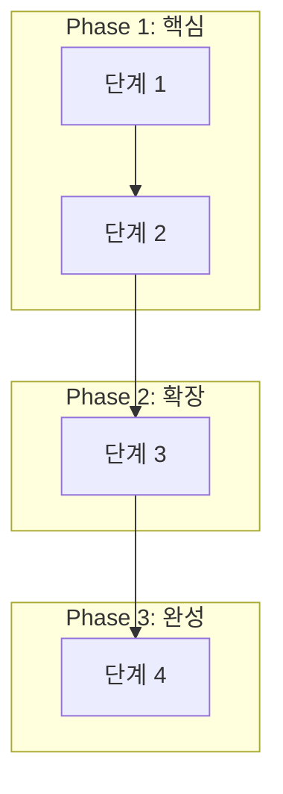

# 1H 애자일 페이즈 (How 구조화 + 단계 설정)

## 목적

2W(What/Why)가 명확해진 후, **How(어떻게)를 다이어그램과 Phase로 구조화**하여 일의 방법과 범위를 통제합니다.

**핵심 철학:**
> "일의 방법(How)과 기간(Time)을 알아도 범위(Scope)가 보이지 않으면 불안해진다.
> 모든 업무는 **'다이어그램을 통한 범위의 시각화'**에서 시작하여 주도권을 확보해야 한다."
> — RESUME_RETROSPECTIVE.md

## 전체 파이프라인

```
[2W1H Pipeline]
/2w-brainstorm → What/Why 정리 + (optional) How 초안
        ↓
/1h-agile-phase → 다이어그램(범위) + Phase(단계) + 지표(평가) ← 현재 스킬
        ↓
/sprint-start   → Phase를 Sprint로 변환하여 실행
```

**이 스킬이 통제하는 것:**

| 통제 영역 | 도구 | 효과 |
|----------|------|------|
| **범위 (Scope)** | Mermaid 다이어그램 | 공간 통제 (In/Out/Deferred) |
| **단계 (Phase)** | Phase 분리 | 논리적 실행 순서 |
| **평가 (Metrics)** | 정량/정성 지표 | 완성 기준 |

**참고:** 구체적인 **Sprint 계획(시간 통제)**은 `/sprint-start` 스킬에서 담당합니다.

---

## 공통 출력 규칙 (Quick Guide + Intent/Review/Cleanup)

`how-diagram.md` 초안은 본문 앞에 `Quick Guide`를 포함해 리뷰 기준을 먼저 고정합니다.

**Quick Guide 필수 구성 (최대 8줄, 내용 파악 중심):**
1. 이번 문서의 핵심 결론 1문장
2. 확정된 범위/단계/지표 결정 2~3개
3. 실행에 바로 영향 주는 항목 2~3개
4. 핵심 가정/근거 1~2개
5. 미확정 항목/리스크 1~2개

**Intent/판단 근거 규칙:**
- 범위 확정(In/Out/Deferred)과 Phase 분리는 선택 이유를 1줄로 남깁니다.
- 지표 선택 시 핵심 가정 또는 기준값 근거를 짧게 표시합니다.

**Review/Cleanup 규칙:**
1. 초안에는 Quick Guide와 의도/근거를 포함해 리뷰를 요청합니다.
2. 리뷰 반영 후 최종본에서는 임시 해설 문구를 제거하거나 최소 요약만 남깁니다.
3. 최종 문서는 다이어그램/범위/로드맵/지표 중심으로 정리합니다.

---

## 필수 사전 준비

**이 스킬 실행 전 확인:**
- [ ] `/2w-brainstorm` 완료 (questions.md + 2w-brainstorm.md 존재)
- [ ] What/Why가 명확함
- [ ] 제약 조건 확인됨 (시간/협업/완성도)
- [ ] 대략적 범위 산정됨 (PoC/MVP/Tutorial)

**⚠️ 위 조건이 충족되지 않으면 `/2w-brainstorm`부터 실행!**

---

## 작동 방식 (Workflow)

### Phase 1: 다이어그램 (범위 시각화)

#### 1.1 2W 결과물 읽기

**Step 1: 파일 확인**
- `problems/[문제명]/questions.md` 읽기
- `problems/[문제명]/2w-brainstorm.md` 읽기

**Step 2: 핵심 정보 추출**
```
- What: [명확해진 문제 정의]
- Why: [왜 해야 하는지]
- 제약 조건: [시간/협업/완성도]
- 대략적 범위: [PoC/MVP/Tutorial]
```

#### 1.2 다이어그램 유형 선택

**문제 유형에 따라 적합한 다이어그램 선택:**

| 문제 유형 | 적합한 다이어그램 | 용도 |
|----------|------------------|------|
| 프로세스/흐름 | Flowchart | 문제 해결 단계 시각화 |
| 시스템 상호작용 | Sequence | API 호출, 컴포넌트 통신 |
| 아키텍처 | C4 Context/Container | 시스템 구조 설계 |
| 데이터 구조 | ER Diagram | 도메인 모델, DB 설계 |
| 상태 변화 | State Diagram | 상태 머신, 워크플로우 |

#### 1.3 Mermaid 다이어그램 생성

**Step 1: 구조 논의**
```
Q: "문제 해결의 주요 단계/컴포넌트는 무엇인가요?"
Q: "각 단계 간의 관계/흐름은 어떻게 되나요?"
```

**Step 2: Mermaid 코드 생성 (Phase로 그룹화)**



#### 1.4 범위 확정 (In/Out/Deferred)

**다이어그램을 보고 명시적으로 범위 확정:**

```
📊 범위 확정:

✅ In Scope (이번에 한다)
- [다이어그램에 포함된 항목들]

❌ Out of Scope (이번에 안 한다)
- [항목] - 이유: [왜 제외]

⏸️ Deferred (나중에 결정)
- [항목] - 조건: [언제 결정할지]
```

---

### Phase 2: Phase 정의 (논리적 단계)

#### 2.1 다이어그램 → Phase 변환

**다이어그램의 그룹을 실행 가능한 Phase로 정의:**

```
Phase 1: [핵심 가치 / MVP]
- 목표: ...
- 포함 범위: ...

Phase 2: [기능 확장 / 안정화]
- 목표: ...
- 포함 범위: ...
```

**주의:** 여기서 구체적인 날짜(Sprint)를 확정하지 않습니다. 논리적인 순서만 잡습니다.

---

### Phase 3: 지표 정의 (평가 기준)

#### 3.1 정량 지표 (Quantitative)

```
📊 정량 지표:

[성능 지표]
- TPS: [목표값]
- Latency: [목표값]
- Before/After: [비교 기준]

[완성도 지표]
- 테스트 커버리지: [목표 %]
- 문서화: [README/블로그]
```

#### 3.2 정성 지표 (Qualitative)

```
📝 정성 지표:

[재현 가능성]
- README만 보고 실행 가능한가?
- 환경 설정이 명확한가?

[명확한 결론]
- "어떤 상황에 어떤 방법"이 명확한가?
- Why/What/How가 문서화되었는가?
```

---

## 문서화 (how-diagram.md)

**파일 생성:** `problems/[문제명]/how-diagram.md`

```markdown
# [문제명] - How 구조화

## Quick Guide (30초 문서 이해 가이드)
- 핵심 결론: 2W 기준으로 이번 실행 범위와 Phase 순서, 완료 지표를 확정한다.
- 확정된 결정: In/Out/Deferred 항목, Phase 경계, 정량/정성 지표 목표값.
- 바로 실행할 내용: Phase 1 시작 범위, 첫 Sprint로 넘길 산출물, 측정 방식 합의.
- 판단 근거: What/Why 제약과 다이어그램 흐름을 기준으로 범위를 분리했다.
- 미확정/리스크: 근거 없는 Deferred, 측정 불가능한 지표, 2W와 불일치한 범위.
- 리뷰 요청 포인트: In/Out/Deferred 타당성과 핵심 지표의 측정 가능성만 먼저 확정한다.

---

## 2W 요약 (from 2w-brainstorm.md)
- **What:** [문제 정의]
- **Why:** [왜 해야 하는지]
- **제약 조건:** [시간/협업/완성도]

---

## 다이어그램

### 유형: [Flowchart/Sequence/C4 등]

```mermaid
[Mermaid 코드]
```

### 다이어그램 설명
[각 단계/컴포넌트 설명]

---

## 범위 확정

### ✅ In Scope
- [항목 1]
- [항목 2]

### ❌ Out of Scope
- [항목 1] - 이유: [왜 제외]

### ⏸️ Deferred
- [항목 1] - 조건: [언제 결정]

---

## Phase 계획 (Roadmap)

| Phase | 목표 | 핵심 태스크 |
|-------|------|-------------|
| Phase 1 | [목표] | [태스크 1, 2] |
| Phase 2 | [목표] | [태스크 3, 4] |

> 각 Phase는 `/sprint-start`를 통해 구체적인 Sprint로 실행됩니다.

---

## 평가 지표

### 정량 지표
- [지표 1]: [목표값]
- [지표 2]: [목표값]

### 정성 지표
- [지표 1]: [기준]
- [지표 2]: [기준]

---

## ADR (Architecture Decision Records)

### ADR-001: [결정 제목]
- **Decision:** [결정 내용]
- **Why:** [이유]
```

---

## 체크포인트

### Phase 1: 다이어그램
- [ ] 2W 결과물 읽었나?
- [ ] 다이어그램 유형 선택했나?
- [ ] Mermaid 코드 생성했나?
- [ ] 범위 확정했나? (In/Out/Deferred)

### Phase 2: Phase 정의
- [ ] 다이어그램 그룹을 Phase로 정의했나?
- [ ] 각 Phase의 목표가 명확한가?
- [ ] 로드맵 테이블 생성했나?

### Phase 3: 지표
- [ ] 정량 지표 정의했나?
- [ ] 정성 지표 정의했나?
- [ ] how-diagram.md 생성했나?

---

## 역할 범위

### ✅ AI가 담당하는 것
- 2W 결과물 읽고 요약
- 다이어그램 유형 제안 및 Mermaid 코드 생성
- 범위 확정 유도
- Phase 논리적 구조화
- 지표 제안
- `how-diagram.md` 작성

### ❌ AI가 하지 않는 것
- 2W 없이 바로 다이어그램 그리지 마라
- 사용자 확인 없이 범위 확정하지 마라
- **사용자 대신 Sprint Goal 결정하지 마라 (이건 /sprint-start에서)**
- **plan.md 파일 생성하지 마라 (이건 /sprint-start에서)**

---

## 다음 단계

**`/1h-agile-phase` 완료 후:**

```
✅ How 구조화가 완료되었습니다!
📄 파일: problems/[문제명]/how-diagram.md

이제 첫 번째 Phase를 실행하기 위해 Sprint를 시작하세요:

> /sprint-start
```

---

## Success Criteria

### 필수 (Must Have)
- [ ] 2W 결과물 기반으로 다이어그램 생성
- [ ] 범위가 명확히 확정됨 (In/Out/Deferred)
- [ ] Phase 구조(로드맵)가 수립됨
- [ ] 평가 지표 정의됨
- [ ] `how-diagram.md` 파일 생성됨

### 최종 목표
- [ ] 사용자가 "범위가 명확해졌다"고 느낌
- [ ] 사용자가 "어떤 순서로 진행해야 할지 보인다"고 느낌
- [ ] **공간 통제(범위) + 논리적 통제(Phase)** 확보

---

**버전:** 1.1.0
**최종 업데이트:** 2026-01-25
**변경 사항:**
- `1h-agile-sprint` → `1h-agile-phase`로 이름 변경
- Sprint 관리를 분리하고 Phase 구조화에 집중
- 입력 파일: `brainstorm.md` → `2w-brainstorm.md` 변경
