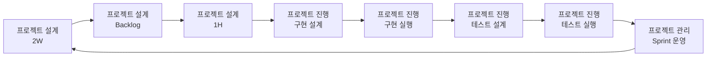

# Agile Loop 1H 철학

## 전체 워크플로우

## 핵심 전환
- 과거 방식: 초기에 큰 설계를 완성
- 현재 방식: 2W(vN) -> Backlog(vN) -> 1H(vN)로 축약해 1페이즈(스프린트) 실행 단위를 명확히 고정

## 왜 이렇게 하나
- 설계는 실행을 위한 가설이며, 한 번에 완성되지 않는다.
- 범위/US/지표를 최소 단위로 고정해야 실행과 학습이 빨라진다.

## 운영 원칙
- Scope 우선: In/Out/Unknown을 먼저 확정한다.
- 1페이즈 안에서 US 단위로 목표를 쪼개고, US는 Step으로 실행한다.
- Metric 최소화: Leading 1개, Outcome 1개만 둔다.

## 완료의 의미
- 1H 완료는 문서 완성이 아니라 스프린트 즉시 착수 가능한 상태를 의미한다.
