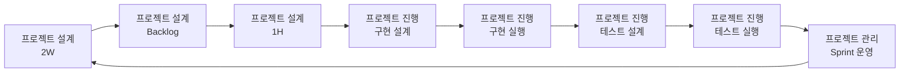

# Agile Loop Backlog 철학

## 전체 워크플로우

## 핵심 전환
- 과거 방식: 2W 이후 바로 1H로 내려가며 범위 충돌을 뒤늦게 발견
- 현재 방식: 2W와 1H 사이에 Backlog 정제를 넣어 우선순위/컷라인을 먼저 확정

## 왜 이렇게 하나
- 2W 직후에는 할 일 목록이 과대/혼합되기 쉽다.
- 백로그 없이 1H를 만들면 설계 범위가 스프린트 용량을 초과한다.
- MVP-0(검증판)과 MVP-1(가치판)을 분리하면 속도와 학습을 동시에 잡을 수 있다.

## 운영 원칙
- MVP는 1스프린트 완성이 아니라 가설 검증 단위로 쪼갠다.
- 1스프린트 안에는 반드시 데모 가능한 End-to-End 1개를 포함한다.
- 우선순위는 가치/학습효과/노력 점수로 정량화한다.
- 1H에는 Backlog에서 컷라인을 통과한 US만 넘긴다.

## 완료의 의미
- Backlog 완료는 태스크 나열이 아니라, "이번 스프린트에서 무엇을 설계할지"가 명확해진 상태다.
