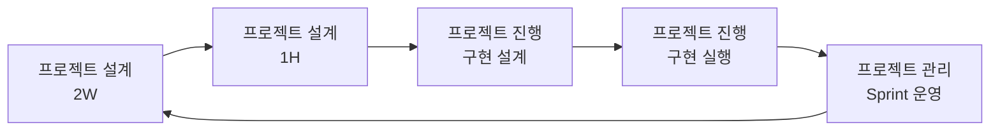

# Agile Loop Sprint 철학

## 전체 워크플로우

## 핵심 전환
- 과거 방식: 설계 이후 실행에만 집중
- 현재 방식: 실행 결과를 다음 2W/1H에 즉시 반영하는 학습 루프

## 왜 이렇게 하나
- 스프린트는 계획 준수 확인이 아니라 가설 검증 단위다.
- 회고 없는 반복은 같은 실수를 반복한다.

## 운영 원칙
- Plan/Status를 분리하고, US 회고와 스프린트 회고를 각각 기록해 증적을 남긴다.
- 스프린트 회고는 `loop-review` 문서를 공식 회고 문서로 사용한다.
- 반박된 가정(False)을 반드시 기록하고 다음 라운드에 반영한다.
- 다음 라운드 진입은 선택이 아니라 기본 동작이다.

## 완료의 의미
- 스프린트 완료는 종료가 아니라 다음 vN+1 설계 입력 생성까지 포함한다.
