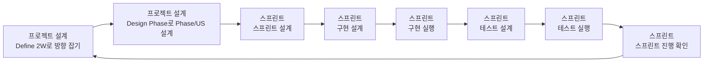

# Define 2W 철학

## 전체 워크플로우

## 핵심 전환
- 과거 방식: 큰 2W를 먼저 확정
- 현재 방식: 스프린트 단위 2W(vN)로 빠르게 정의하고 반복 갱신

## 왜 이렇게 하나
- 머릿속 모호성은 질문만으로 완전히 제거되지 않는다.
- 실행 이전에 큰 범위를 확정하면 가정 오류를 늦게 발견한다.
- 2W를 작게 잡으면 검증 비용이 낮고, 수정이 빠르다.

## 운영 원칙
- 사용자의 자유 발화(주로 How)에서 What/Why를 역추출한다.
- 2W는 정답 문서가 아니라 현재 가설 문서다.
- 성공 기준 1개, 경계 1개만 확정해 의사결정 피로를 줄인다.

## 사례 연구 원칙
- 사례 연구는 기본이 아니라 선택이다.
- AI가 추천하고 사용자가 진행/생략을 선택한다.
- 진행 시 최대 3개 사례, 사례당 3줄 요약, 별도 결과 파일로 증적을 남긴다.

## 패턴 연구 원칙
- 안티패턴/베스트 프랙티스 연구도 기본이 아니라 선택이다.
- AI가 추천하고 사용자가 진행/생략을 선택한다.
- 진행 시 안티패턴 최대 3개 + 베스트 프랙티스 최대 3개, 항목당 3줄 요약으로 기록한다.

## 완료의 의미
- 2W 완료는 설계 종료가 아니라 `design-phase`로 넘어갈 준비 완료를 뜻한다.
