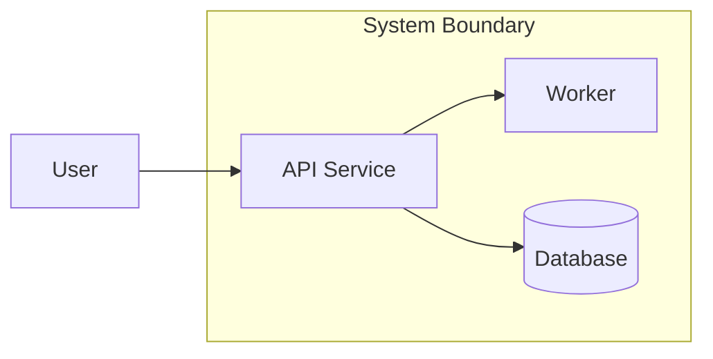
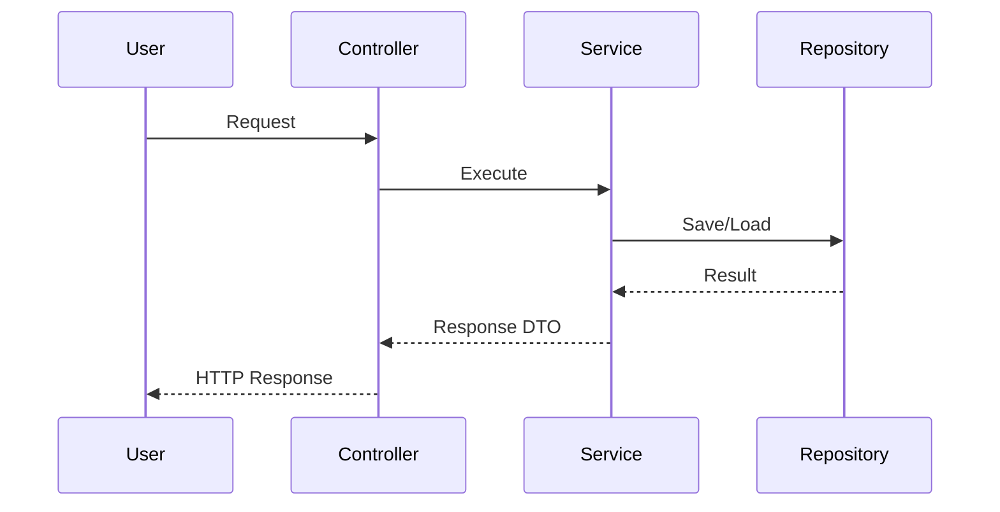
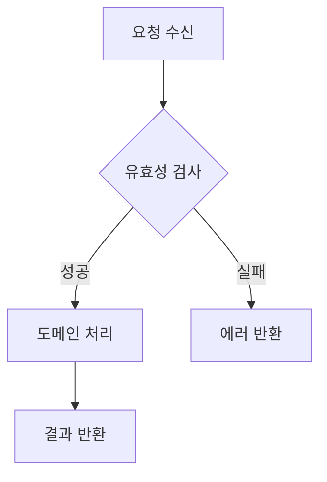

# Design Implementation vN - [문제명]

## 빠른 안내
- 핵심 결론:
- 확정된 설계 결정 2~3개:
- 바로 구현할 항목:
- 핵심 리스크:

## 기술 스택 문서
- 경로: `.agile/context/tech-stack.md`
- 사용 방식: 기존 문서 재사용 | 일부 수정 | 신규 생성

## 대상 US
- US-1:
- US-2:

## 기능 정리
- 기능 1:
- 기능 2:

## 구현 경계
### 포함(In Scope)
- 항목 1:

### 제외(Out of Scope)
- 항목 1:

## C4 Container 판단 게이트
- AI 추천: 생성 권장 | 생략 권장
- 추천 근거(1줄):
- 사용자 선택: 생성 | 생략

## C4 Container

## Sequence

## Flowchart

## 인터페이스 정의
- 입력:
- 출력:
- 이벤트/메시지:

## ADR 요약
### ADR-001: [결정 제목]
- Decision:
- Why:
- Trade-off:

## 구현 전달 정보
- 구현 우선순위:
- 테스트 포인트:
- 리스크/완화:
