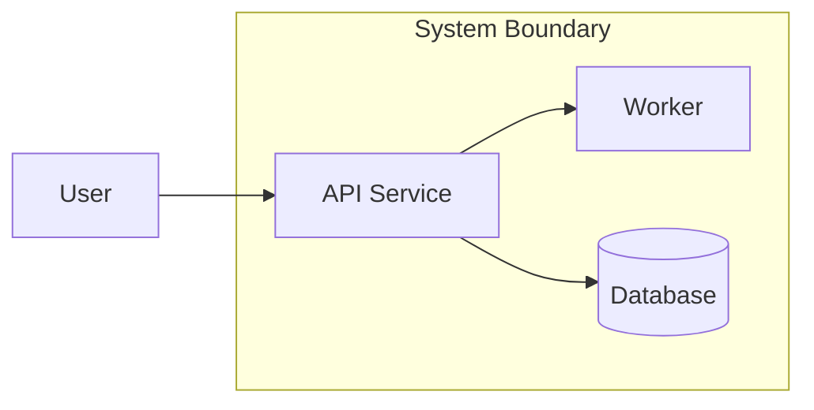
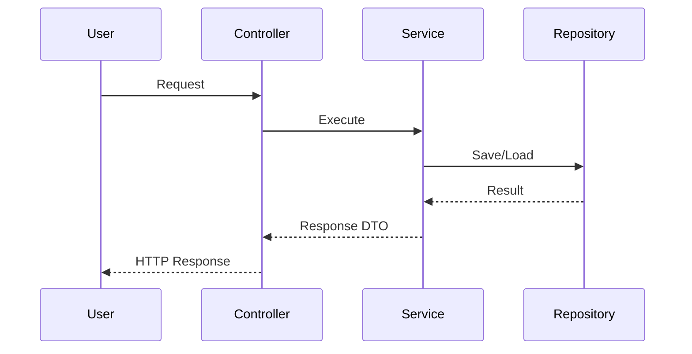
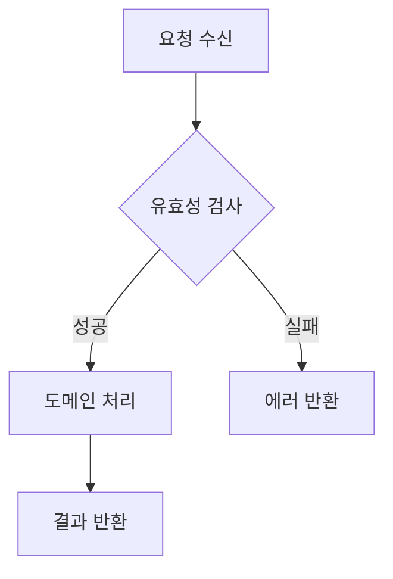

# Design Implementation vN - [문제명]

## 한눈에 결론
- 설계 핵심 결론:
- 확정된 설계 결정 2~3개:
- 바로 구현할 항목:
- 핵심 리스크:

---

## 1) 대상 범위와 목표
- 대상 US:
- 이번 설계 목표:
- 완료 기준:
- 제외 범위:

## 2) 기술 스택과 전제
- 기술 스택 문서: `.agile/context/tech-stack.md`
- 사용 방식: 기존 문서 재사용 | 일부 수정 | 신규 생성
- 설계 전제/제약:

## 3) 구조 설계
### 3-1. 기능과 경계
- 핵심 기능:
- 포함(In Scope):
- 제외(Out of Scope):

### 3-2. 다이어그램
#### C4 Container (필요 시)

#### Sequence

#### Flowchart

## 4) 인터페이스와 ADR
### 4-1. 인터페이스 정의
- 입력:
- 출력:
- 이벤트/메시지:

### 4-2. ADR 요약
| ADR | Decision | Why | Trade-off |
| --- | --- | --- | --- |
| ADR-001 |  |  |  |

## 5) 구현 전달 정보
- 구현 우선순위:
- 테스트 포인트:
- 리스크/완화:
- 선행 의존사항:

---

## 부록) 운영 로그 (필요 시만 작성)
- C4 판단 게이트: AI 권장 | 사용자 선택 | 근거
- 설계 변경 이력:
