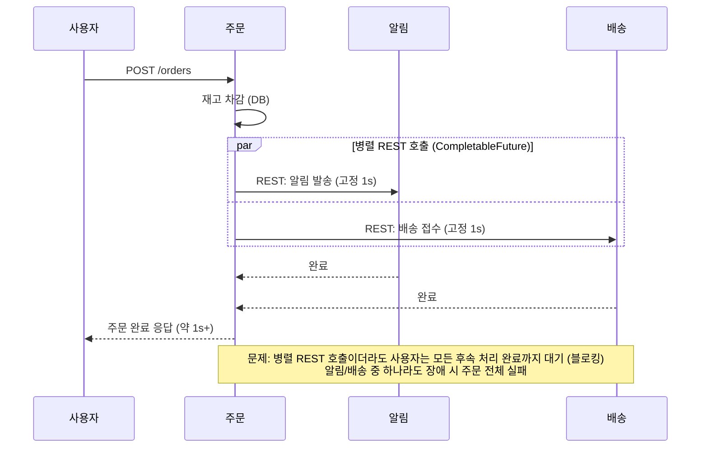
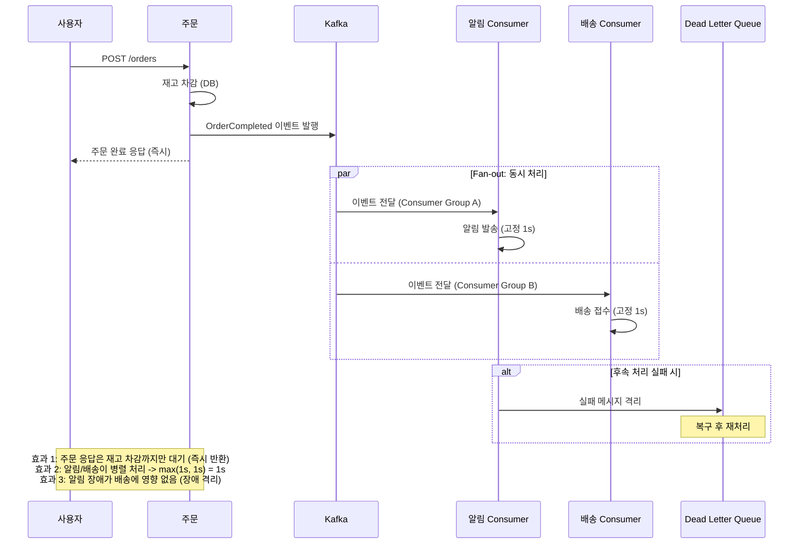
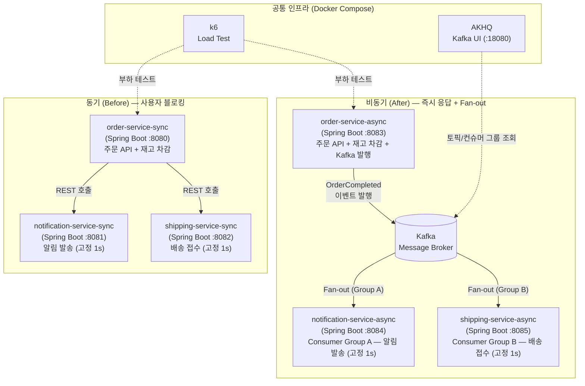
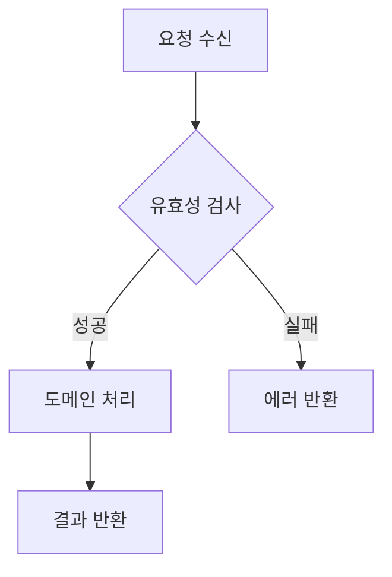
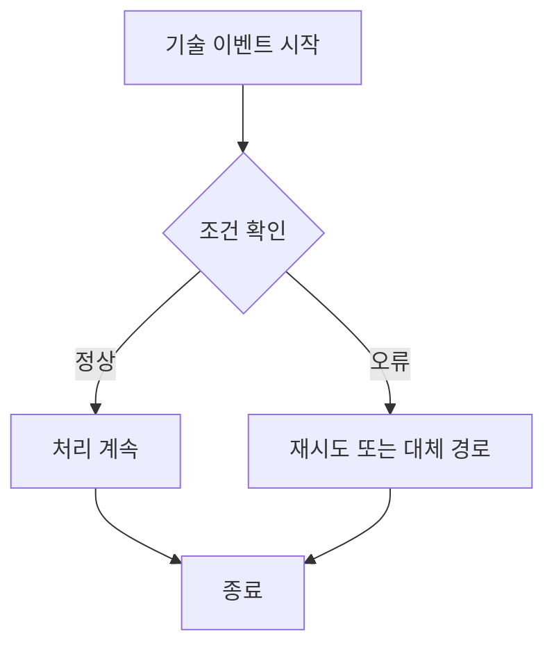

# Design Implementation - [문제명]

## 한눈에 결론
- 설계 핵심 결론:
- 확정된 설계 결정 2~3개:
- 바로 구현할 항목:
- 핵심 리스크:

---

## 1) 구조 설계
### 1-1. 기능과 경계
- 핵심 기능:
- 포함(In Scope):
- 제외(Out of Scope):

### 1-2. 다이어그램 (Business-first, 다중 허용)
- 작성 원칙:
  - 비즈니스 흐름 다이어그램을 먼저 제시한다. (필수, 1개 이상)
  - 기술 흐름 다이어그램은 구현 리스크를 줄이기 위한 보조로 추가한다. (선택, 0개 이상)
  - 동일 타입 다이어그램도 시나리오별로 여러 개 작성할 수 있다.
  - 동일 문제 축(예: EDA 주문 팬아웃 비교)을 유지하면 `.agile/sprints/sprint-0/1-direction/design-phase.md` 기준본을 우선 재사용하고 이번 US의 변경점만 메모한다.

#### A. 비즈니스 흐름 다이어그램 (필수, 1개 이상)
##### A-1. 동기 방식 비즈니스 흐름 (Before, 기준본 재사용 권장)


##### A-2. 비동기 방식 비즈니스 흐름 (After, 기준본 재사용 권장)


##### A-3. [선택] 추가 비즈니스 흐름 (실패/복구/보상)
```mermaid
sequenceDiagram
  participant Actor as 액터
  participant Domain as 도메인 서비스

  Actor->>Domain: 비즈니스 요청
  alt 성공
    Domain-->>Actor: 완료/상태 업데이트
  else 실패
    Domain-->>Actor: 실패 사유 + 보상/재시도 정책
  end
```

#### B. 기술 흐름 다이어그램 (선택, 0개 이상)
##### B-1. C4 Container (기준본 재사용 권장)


##### B-2. 구현 순서 Flowchart (US 전달용)


##### B-3. [선택] 추가 기술 흐름 (재시도/배포/관측성 등)


## 2) 인터페이스와 ADR
### 2-1. 인터페이스 정의
- 입력:
- 출력:
- 이벤트/메시지:

### 2-2. ADR 요약
| ADR | Decision | Why | Trade-off |
| --- | --- | --- | --- |
| ADR-001 |  |  |  |

## 3) 구현 전달 정보
- 구현 우선순위:
- 대표 1개 선행 + 확장 게이트:
  - 기본 순서: `sync 대표 -> sync 확장 -> async 대표 -> async 확장`
  - Sync 대표 서비스(먼저 구현):
  - Async 대표 서비스(먼저 구현):
  - 리뷰 게이트 통과 조건:
  - 자동 확장 대상/방식:
- 테스트 포인트:
- 리스크/완화:
- 선행 의존사항:
- US 루프 순서: `execute-implementation -> design-test -> execute-test -> monitor-sprint`

## 4) 대상 범위와 목표
- 대상 US (기본 1개):
- 동시 설계 여부: 단일 US | 다중 US(예외)
- 다중 US 예외 근거(해당 시):
- 이번 설계 목표:
- 완료 기준:
- 제외 범위:

## 5) 기술 스택과 전제
- 기술 스택 문서: `.agile/context/tech-stack.md`
- 사용 방식: 기존 문서 재사용 | 일부 수정 | 신규 생성
- 재사용 우선 검토 결과: `tech-stack.md`의 `재사용 우선 후보 비교` 및 `직접 구현 예외 검토` 섹션 참조
- 설계 전제/제약:

---

## 부록) 운영 로그 (필요 시만 작성)
- C4 판단 게이트: AI 권장 | 사용자 선택 | 근거
- 설계 변경 이력:
