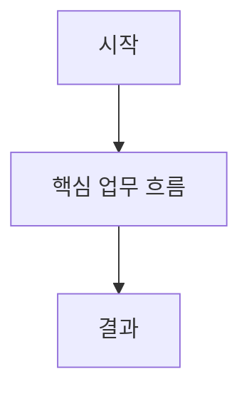
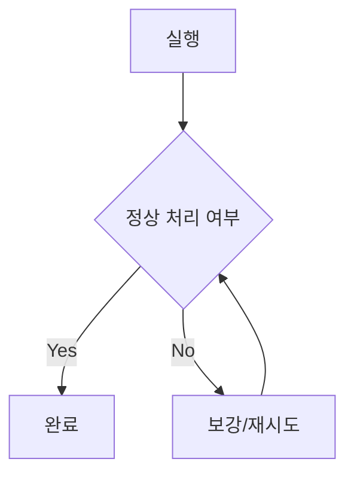
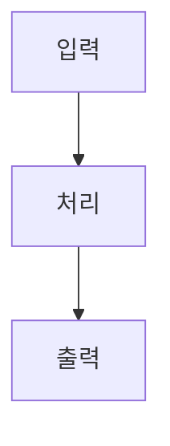
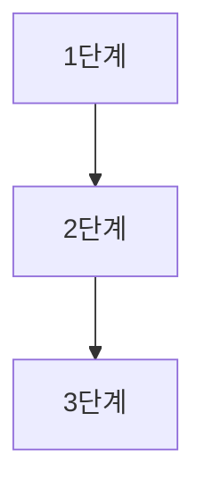

# Design Implementation - [문제명]

## 1) 해결해야 할 문제와 목표
이번 설계에서 무엇을 해결하려는지 먼저 문장으로 정리한다.  
핵심은 "지금 막히는 지점이 무엇인지"와 "이번 문서가 어떤 실행 결정을 내려주는지"가 이어져 보이게 쓰는 것이다.

### 1-1. 현재 상황
- 현재 어떤 문제가 남아 있는지:
- 이 문제가 실무에서 어떤 비용/지연을 만드는지:

### 1-2. 이번 설계 목표
- 이번 문서가 끝나면 무엇이 실행 가능해지는지:
- 이번 설계의 핵심 판단 2~3개:

### 1-3. 포함/제외 범위
| 구분 | 내용 |
| --- | --- |
| In Scope |  |
| Out of Scope |  |

---

## 2) 핵심 설계 판단과 이유
결론만 나열하지 말고, 각 결정을 왜 채택했는지와 감수하는 trade-off를 함께 적는다.

| Decision | 왜 이 결정을 했는가 | 기대 효과 | Trade-off |
| --- | --- | --- | --- |
|  |  |  |  |

---

## 3) 흐름 설계 (Business-first)
이 섹션은 다이어그램 자체보다 "흐름이 무엇을 증명하는지"를 먼저 설명한다.

### 3-1. 비즈니스 흐름 (필수, 1개 이상)
이 흐름으로 무엇이 개선되는지 2~4문장으로 먼저 적고 다이어그램을 제시한다.

#### A-1. 핵심 비즈니스 흐름

#### A-2. 실패/지연 시 처리 흐름

### 3-2. 기술 흐름 (선택)
기술 다이어그램을 생략했다면 "왜 생략해도 실행 리스크가 낮은지"를 문장으로 남긴다.

#### B-1. 기술 구조(선택)

#### B-2. 구현 순서(선택)

---

## 4) 실행 인계 (execute-implementation 입력)
이 섹션은 구현자가 "왜 이 순서로 해야 하는지"를 이해할 수 있게 작성한다.

### 4-1. US 스텝 설계
| Step ID | 목표 | 선행조건/입력 | 핵심 작업 | 산출물 | 완료 기준(DoD) | 검증 방법 |
| --- | --- | --- | --- | --- | --- | --- |
| `1.1.1-a` |  |  |  |  |  |  |
| `1.1.1-b` |  |  |  |  |  |  |
| `1.1.1-c` |  |  |  |  |  |  |

스텝을 나열한 뒤, 왜 이 순서가 맞는지 2~4문장으로 설명한다.

### 4-2. 검증 전략과 리스크
| 항목 | 내용 |
| --- | --- |
| 구현 우선순위 |  |
| 리뷰 게이트 통과 조건 |  |
| 테스트 포인트 |  |
| 주요 리스크와 완화 |  |
| 선행 의존사항 |  |
| US 루프 순서 | `execute-implementation -> design-test -> execute-test -> monitor-sprint` |

---

## 5) 인터페이스와 ADR
### 5-1. 인터페이스 정의
| 구분 | 내용 |
| --- | --- |
| 입력 |  |
| 출력 |  |
| 이벤트/메시지 |  |

### 5-2. ADR 요약
| ADR | Decision | Why | Trade-off |
| --- | --- | --- | --- |
| ADR-001 |  |  |  |

---

## 6) 완료 조건과 다음 연결
이번 설계가 끝났다고 판단하는 기준과, 다음 스킬로 어떻게 인계하는지 문장으로 마무리한다.

| 항목 | 내용 |
| --- | --- |
| 대상 US |  |
| 완료 기준(DoD) |  |
| 제외 범위 |  |
| 다음 루프 | `execute-implementation -> design-test -> execute-test -> monitor-sprint` |

---

## 부록) 운영 로그 (필요 시)
- 브랜치/스프린트 정합성:
- C4 판단 게이트(작성/생략 + 이유):
- 설계 변경 이력:
