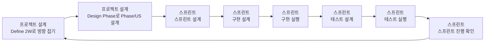

# Design Phase 철학

## 전체 워크플로우

## 핵심 전환
- 과거 방식: 초기에 큰 설계를 완성
- 현재 방식: define-2w(vN) 다음에 design-phase에서 Phase+US 흐름을 먼저 고정

## 왜 이렇게 하나
- 설계는 실행을 위한 가설이며, 한 번에 완성되지 않는다.
- Phase를 먼저 고정하면 전체 흐름(현재/다음 단계)이 선명해진다.
- Phase/US 설계에서 Step까지 확정하면 실행 중 변경 비용이 커진다.

## 운영 원칙
- 먼저 Phase와 US를 확정한다.
- Scope 우선: In/Out/Unknown을 먼저 확정한다.
- design-phase에서는 US까지 설계하고, Step은 Sprint Plan에서 작성한다.
- Metric 최소화: Leading 1개, Outcome 1개만 둔다.

## 완료의 의미
- design-phase 완료는 `.agile/loops/loop-vN/design-phase.md`에 Phase/US/지표/완료조건이 확정되어 스프린트 즉시 착수 가능한 상태를 의미한다.
