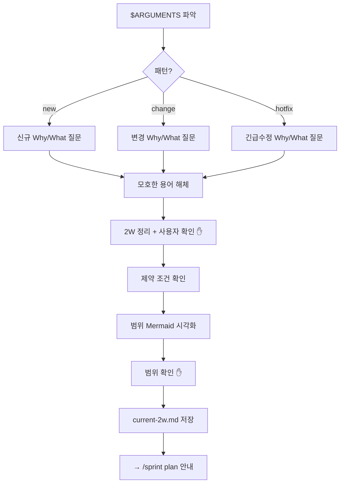
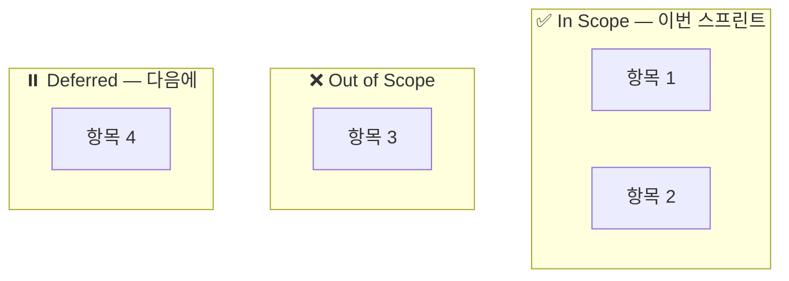

# 2W 서사 스킬

`$ARGUMENTS`에서 패턴을 파악한다. 없으면 `new`로 간주한다.

- `new` → 신규 프로젝트 2W
- `change` → 기존 프로젝트 변경 2W
- `hotfix` → 긴급 수정 2W

시작 전, `.claude/agile/current-2w.md`가 존재하면 읽어서 이전 컨텍스트를 파악하고 사용자에게 알린다.

---

## 전체 흐름



---

## [new] 신규 프로젝트

### Why 질문

```
[Why] 이 프로젝트를 왜 만드는 건가요?
- 어떤 문제를 해결하려는 건가요?
- 완료되면 무엇이 달라지나요?
```

### What 질문

```
[What] 구체적으로 무엇을 만들 건가요?
- 완성의 정의는 무엇인가요? (완료 기준)
- 결과물의 형태는? (앱, 문서, 라이브러리 등)
```

---

## [change] 기존 프로젝트 변경

### Why 질문

```
[Why] 현재 무엇이 문제인가요?
- 지금 어떤 상황이고, 왜 변경이 필요한가요?
- 변경하지 않으면 어떤 일이 생기나요?
```

### What 질문

```
[What] 무엇을 바꾸고 무엇을 유지하나요?
- 변경 범위: 어디까지 손대는 건가요?
- 유지 범위: 건드리지 않을 것은 무엇인가요?
- 완료 기준: 어떻게 되면 변경이 완료된 건가요?
```

---

## [hotfix] 긴급 수정

### Why 질문

```
[Why] 무엇이 언제부터 왜 깨졌나요?
- 증상: 어떤 오류/문제가 발생하고 있나요?
- 발생 시점: 언제부터인가요? 트리거가 있나요?
- 영향 범위: 어디까지 영향을 주고 있나요?
```

### What 질문

```
[What] 최소 범위 수정은 무엇인가요?
- 지금 당장 막아야 할 것은 무엇인가요?
- 임시 대응 vs 근본 수정 중 어떤 방향인가요?
- 완료 기준: 어떻게 되면 픽스가 된 건가요?
```

---

## 공통 프로세스 (패턴 무관)

### 모호한 용어 해체

답변에서 추상적 용어가 나오면 반드시 구체화를 요청한다.

예시:
- "성능 개선" → "어떤 지표? 현재 수치 vs 목표 수치는?"
- "사용성 개선" → "어떤 사용자의 어떤 행동이 불편한가?"
- "리팩토링" → "무엇을 위한 리팩토링? 완료 기준은?"

**멈춤 기준**: 모호한 용어가 남아 있으면 다음 단계로 넘어가지 않는다.

### 2W 정리 + 사용자 확인

아래 형식으로 정리하고 확인을 받는다:

```
📋 2W 정리 [{패턴}]

Why: {한 문장 목적 또는 문제}
What: {변경/생성 대상과 범위}
완성의 정의:
  - {완료 기준 1}
  - {완료 기준 2}

이 이해가 맞나요? 맞으면 제약 조건 확인으로 넘어갑니다.
```

**사용자 확인 없이 다음 단계로 넘어가지 않는다.**

### 제약 조건 확인

```
[제약 조건]
1. 시간: 얼마나 시간을 쓸 수 있나요? (예: 1주, 2주)
2. 팀: 혼자인가요, 팀인가요?
3. 완성도: PoC / MVP / 완성품 중 목표는?
4. 스프린트 단위: 1주? 2주? 직접 설정?
```

### 범위 시각화

제약 확인 후 Mermaid 다이어그램을 생성한다:



다이어그램을 보여주고 **사용자 확인**을 받는다.

### current-2w.md 저장

사용자 확인 후 `.claude/agile/current-2w.md`를 생성 또는 갱신한다:

```markdown
# 현재 2W

**패턴**: {new|change|hotfix}
**작성일**: {날짜}

## Why
{Why 한 문장}

## What
{What 설명}

## 완성의 정의
- {완료 기준 1}
- {완료 기준 2}

## 제약 조건
- 시간: {기간}
- 팀: {인원}
- 완성도: {PoC/MVP/완성품}
- 스프린트 단위: {기간}

## 범위

### In Scope
- {항목}

### Out of Scope
- {항목}

### Deferred
- {항목}
```

저장 후 안내한다:

```
✅ 2W 서사 완료. /sprint plan 으로 스프린트 계획을 시작하세요.
```
