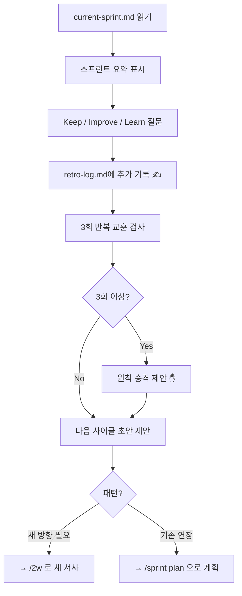

# 회고 스킬

시작 시 다음 파일을 읽는다:
- `.claude/agile/current-sprint.md` — 이번 스프린트 내용
- `.claude/agile/retro-log.md` — 누적 회고 기록 (없으면 새로 생성)

---

## 전체 흐름



---

## Step 1: 스프린트 요약 표시

`current-sprint.md`를 읽어 이번 스프린트를 요약한다:

```
📋 스프린트 회고
🎯 목표: {목표}
📅 기간: {기간}

완료된 태스크:
  ✅ 태스크 A
  ✅ 태스크 B

미완료:
  ⏳ 태스크 C (Should → Deferred 이동)
```

---

## Step 2: Keep / Improve / Learn 질문

세 가지를 순서대로 묻는다:

```
🔍 회고를 시작합니다.

1. Keep — 잘된 점, 다음에도 유지할 것은?
2. Improve — 아쉬운 점, 바꿀 것은?
3. Learn — 이번 스프린트의 핵심 교훈을 한 문장으로?
```

---

## Step 3: retro-log.md 기록

`.claude/agile/retro-log.md`에 **추가**한다. 기존 내용을 덮어쓰지 않는다.

```markdown
---

## {날짜} 회고

**스프린트 목표**: {목표}
**기간**: {기간}

| 구분 | 내용 |
|------|------|
| Keep | {잘된 점} |
| Improve | {아쉬운 점} |
| Learn | {교훈 한 문장} |
```

---

## Step 4: 3회 반복 교훈 → 원칙 승격

`retro-log.md` 전체를 읽어 Learn 항목에서 **동일하거나 유사한 교훈이 3회 이상** 등장하는지 확인한다.

3회 이상이면:

```
💡 원칙 승격 제안

"{교훈}"이 {N}회 반복되었습니다.
이것을 원칙으로 등록할까요?
→ .claude/agile/principles.md에 추가됩니다.
```

사용자 승인 시 `.claude/agile/principles.md`에 추가한다:

```markdown
## {날짜} 등록

**원칙**: {교훈}
**근거**: {N}회 반복 (회고 날짜: {날짜1}, {날짜2}, {날짜3})
```

---

## Step 5: 다음 사이클 초안 제안

`current-sprint.md`의 Deferred 항목과 Improve 내용을 바탕으로 다음 사이클을 제안한다.

### 케이스 A: 기존 방향 연장 (Deferred 항목이 있고 Why/What이 동일)

```
🔄 다음 스프린트 초안

이번 Deferred → 다음 In Scope 검토:
  - {Deferred 항목 1}
  - {Deferred 항목 2}

반영할 Improve:
  - {아쉬운 점} → {다음 스프린트에서 바꿀 것}

Why/What이 유지된다면 /sprint plan 으로 바로 계획을 시작할 수 있습니다.
```

### 케이스 B: 새 방향 필요 (목표가 달성되었거나 방향이 바뀜)

```
🔄 새 사이클 시작

이번 스프린트로 "{목표}"가 완료되었습니다.
새로운 방향이 필요하다면 /2w 로 다음 목적을 정의하세요.
```

---

## 파일 규약

| 파일 | 역할 | 쓰기 방식 |
|------|------|----------|
| `.claude/agile/current-2w.md` | 현재 2W 서사 | `/2w`가 작성, `/sprint plan`이 읽기 |
| `.claude/agile/current-sprint.md` | 현재 스프린트 | `/sprint plan`이 작성, `/sprint run`·`/retro`가 읽기 |
| `.claude/agile/retro-log.md` | 누적 회고 기록 | `/retro`가 append (덮어쓰기 금지) |
| `.claude/agile/principles.md` | 승격된 원칙 | `/retro`가 사용자 승인 후 추가 |
