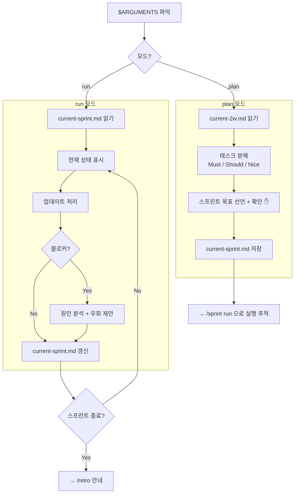

# 스프린트 스킬

`$ARGUMENTS`에서 모드를 파악한다. 없으면 `plan`으로 간주한다.

- `plan` → 스프린트 계획 수립
- `run` → 실행 상태 추적

---

## 전체 흐름



---

## [plan] 스프린트 계획 수립

### 1. 컨텍스트 파악

`.claude/agile/current-2w.md`를 읽는다.

파일이 없으면:
```
⚠️ current-2w.md가 없습니다. 먼저 /2w 로 2W 서사를 작성해 주세요.
```

파일이 있으면 2W 요약을 보여준다:
```
📋 2W 확인
Why: {Why 내용}
What: {What 내용}
In Scope: {항목 목록}
```

### 2. 태스크 분해

In Scope 항목을 구체적인 실행 단위로 분해하고 우선순위를 매긴다:

- **Must**: 스프린트 목표 달성에 필수. 이것만 해도 완료.
- **Should**: 가능하면 포함. 없어도 스프린트는 성공.
- **Nice**: 시간 여유 시. 없어도 무방.

### 3. 스프린트 목표 선언 + 확인

아래 형식을 보여주고 사용자 확인을 받는다:

```
🎯 스프린트 목표: {한 문장}
📅 기간: {시작일} ~ {종료일}
👤 담당: {이름 또는 역할}

Must (필수):
- [ ] 태스크 A
- [ ] 태스크 B

Should (가능하면):
- [ ] 태스크 C

Nice (시간 여유 시):
- [ ] 태스크 D

이 계획으로 스프린트를 시작할까요?
```

**사용자 확인 없이 저장하지 않는다.**

### 4. current-sprint.md 저장

확인 후 `.claude/agile/current-sprint.md`를 생성 또는 갱신한다:

```markdown
# 현재 스프린트

**목표**: {스프린트 목표}
**기간**: {시작일} ~ {종료일}
**담당**: {이름/역할}
**완성도 목표**: {PoC/MVP/완성품}

## Must
- [ ] 태스크 A
- [ ] 태스크 B

## Should
- [ ] 태스크 C

## Nice
- [ ] 태스크 D

## Deferred (다음 스프린트 검토)
- {current-2w.md의 Deferred 항목}

---
*생성: {날짜}*
```

저장 후 안내한다:
```
✅ 스프린트 계획 완료. /sprint run 으로 실행을 추적하세요.
```

---

## [run] 실행 상태 추적

### 1. 현재 상태 표시

`.claude/agile/current-sprint.md`를 읽어 상태를 파악한다.

파일이 없으면:
```
⚠️ current-sprint.md가 없습니다. 먼저 /sprint plan 으로 계획을 수립해 주세요.
```

파일이 있으면 현재 상태를 표시한다:

```
📊 스프린트 현황
🎯 목표: {목표}
📅 {시작일} ~ {종료일}

✅ Done       : 태스크 A
🔄 In Progress: 태스크 B
⏳ Todo       : 태스크 C, D
🚫 Blocked    : 없음
```

### 2. 업데이트 처리

사용자가 상태 변경을 요청하면 `current-sprint.md`의 체크박스를 수정한다.

사용자 입력 패턴 예시:
- "태스크 A 완료" → `[ ]` → `[x]`
- "태스크 B 진행 중" → In Progress 메모 추가
- "태스크 C 블로커 발생" → Blocked 섹션에 추가

### 3. 블로커 대응

블로커 발생 시:
1. 블로커 원인을 한 문장으로 정리한다
2. 우회 방법 또는 범위 축소 옵션을 제안한다:
   - 우회: 다른 방법으로 같은 목표를 달성할 수 있는가?
   - 축소: 이 태스크를 Should/Nice로 내리거나 Deferred로 이동할 수 있는가?
3. 사용자가 결정하면 `current-sprint.md`를 갱신한다

### 4. 스프린트 종료 감지

Must 항목이 모두 완료되면:
```
🎉 Must 태스크가 모두 완료되었습니다.
스프린트를 종료하고 회고를 진행할까요?
→ /retro 로 회고를 시작하세요.
```
