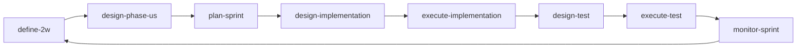

# 메인 8개 스킬 구성 요약

## Flowchart


## 스킬별 1줄 설명
- `define-2w`: 사용자 입력에서 What/Why를 도출해 2W를 확정한다.
- `design-phase-us`: 2W 기반으로 Phase/US/지표를 설계한다.
- `plan-sprint`: 스프린트 계획/상태/회고 문서를 운영한다.
- `design-implementation`: 구현 범위/다이어그램/인터페이스/ADR을 설계한다.
- `execute-implementation`: 구현 코드를 작성하고 결과를 US 단위로 문서화한다.
- `design-test`: 테스트 케이스와 우선순위를 설계한다.
- `execute-test`: 테스트를 실행하고 실패 분석/재검증을 기록한다.
- `monitor-sprint`: 현재 스프린트 진행률/일정 상태를 시각화한다.

## 산출물 저장 경로 (통합 트리)
```text
problems/
└─ [문제명]/
   ├─ 2w-vN.md
   ├─ case-study-vN.md
   ├─ 1h-vN.md
   ├─ tech-stack.md
   ├─ design-implementation-vN.md
   ├─ execute-implementation-us-N.M-vN.md
   ├─ design-test-us-N.M-vN.md
   └─ execute-test-us-N.M-vN.md

.agile/
└─ sprints/
   └─ sprint-N/
      ├─ plan.md
      ├─ status.md
      ├─ us-N.M-retrospective.md
      └─ loop-review-vN.md
```

참고:
- `monitor-sprint`는 조회형 스킬이며 별도 산출물 파일을 생성하지 않는다.
