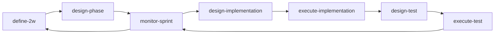

# 스킬 운영 문서

이 문서는 스킬을 수정/추가하기 전에 기준점으로 삼는 운영 문서다.
변경 제안은 이 문서 기준으로 브레인스토밍한 뒤 반영한다.
레거시 스킬 매핑/전환 기준은 `docs/operations/skills-lifecycle.md`를 참고한다.

## 운영 흐름


## 워크플로우 핵심 관점
- 전체 스킬 워크플로우의 시작점은 `정확한 문제 정의(2W)`다.
- 문제 정의가 확정되면 `design-phase`에서 이번 루프의 `MVP` 해결 범위를 명확화한다.
- 이후 확정된 MVP 범위 안에서 실행/검증한다.
- 루프 종료 시 학습 결과를 반영해 다음 루프에서 범위를 확장하거나 문제 정의를 보정한다.
- 운영의 기본 사이클은 `문제 정의 -> MVP 범위 해결 -> 다음 루프 확장`의 반복이다.

## 스킬별 1줄 설명
- `define-2w`: 사용자 입력에서 What/Why를 도출해 문제 정의(2W)를 확정한다.
- `design-phase`: 2W 기반으로 MVP 범위(In/Out/Unknown)와 Phase/US/지표를 설계한다.
- `monitor-sprint`: 스프린트 상태 문서를 bootstrap/갱신하고 진행률/리스크/다음 스킬 라우팅을 제공한다.
- `design-implementation`: 구현 범위/다이어그램/인터페이스/ADR을 설계한다.
- `execute-implementation`: 구현 코드를 작성하고 결과를 US 단위로 문서화한다.
- `design-test`: 테스트 케이스와 우선순위를 설계한다.
- `execute-test`: 테스트를 실행하고 실패 분석/재검증을 기록한다.
- `record-adr`: 기술/아키텍처 의사결정을 ADR 문서로 기록하고 추적한다.
- `sync-agent-skills`: 에이전트 간 스킬 디렉터리를 현재 에이전트 형식으로 동기화한다.
- `manage-experience`: 스킬별 경험 문서를 초기화하고 실전 패턴을 누적/정제한다.
- `migrate-legacy-artifacts`: 구버전 산출물을 프로젝트 공통 자동 탐색으로 신버전 산출물 경로에 안전하게 마이그레이션한다.

## 산출물 저장 경로 (통합 트리)
```text
.agile/
├─ context/
│  └─ tech-stack.md
├─ migration/
│  └─ legacy-migration-report-vN.md
└─ loops/
   └─ loop-vN/
      ├─ 01-01-define-2w-phase-briefing.md
      ├─ 01-02-define-2w.md
      ├─ 01-03-define-2w-case-study.md
      ├─ 01-04-define-2w-patterns.md
      ├─ 02-design-phase.md
      ├─ 03-design-implementation.md
      ├─ 04-execute-implementation-us-N.M.md
      ├─ 05-design-test-us-N.M.md
      ├─ 06-execute-test-us-N.M.md
      └─ sprint/
         ├─ 02-sprint-status.md
         ├─ 03-us-N.M-retrospective.md
         └─ 04-sprint-retrospective.md
docs/
└─ adr/
   ├─ ADR-001-title.md
   └─ ADR-002-title.md
.codex/
└─ skills/
   └─ <skill-name>/
      └─ references/
         └─ experience.md
```

참고:
- `monitor-sprint`는 `02-sprint-status.md`를 단일 소스로 관리하며, 없으면 bootstrap으로 생성한다.
- `monitor-sprint`는 US/Sprint 완료 시 회고 파일(`03-us-N.M-retrospective.md`, `04-sprint-retrospective.md`)을 생성한다.
- `sync-agent-skills`는 프로젝트 산출물 대신 스킬 디렉터리(`.codex/skills`, `.claude/skills`, `.gemini/skills`)를 갱신한다.
- `manage-experience`는 프로젝트 산출물 대신 각 스킬의 `references/experience.md`를 생성/갱신한다.
- `migrate-legacy-artifacts`는 레거시 문서를 신버전 경로로 복사/매핑하고 리포트를 `.agile/migration/`에 남긴다.

## 변경 제안 체크리스트
| 점검 항목 | 확인 | 메모 |
|---|---|---|
| 제안 목적이 `What/Why 우선` 원칙과 충돌하지 않는가? | [ ] |  |
| 제안 스킬의 책임이 프로젝트 설계(`define-2w`, `design-phase`), 스프린트 운영(`monitor-sprint`, `design-implementation`, `execute-implementation`, `design-test`, `execute-test`), 의사결정 기록(`record-adr`), 운영 동기화(`sync-agent-skills`), 경험 자산 관리(`manage-experience`), 레거시 마이그레이션(`migrate-legacy-artifacts`) 중 어디인지 명확한가? | [ ] |  |
| 기존 스킬과 역할이 겹치지 않고 경계가 명확한가? | [ ] |  |
| 입력/출력 산출물 경로가 `.agile/loops/loop-vN/` 규칙을 따르는가? | [ ] |  |
| 산출물 파일명이 스킬명/역할과 일관되고 의미가 명확한가? | [ ] |  |
| 사용자 확인 게이트가 필요한 단계인지, 필요 시 질문이 최소화되어 있는가? | [ ] |  |
| 사례 연구/웹 검색이 필요한 경우 실행 조건과 최대 범위(비용/토큰)가 정의되어 있는가? | [ ] |  |
| 문서 템플릿 변경 시 관련 스킬 `SKILL.md`와 참조 문서 경로가 함께 갱신되는가? | [ ] |  |
| 기존 프로젝트와의 호환(레거시 파일명/경로 처리)이 필요한지 검토했는가? | [ ] |  |
| 변경 후 운영 흐름(2W -> Phase -> Monitor/Execution 루프)이 끊기지 않는가? | [ ] |  |
