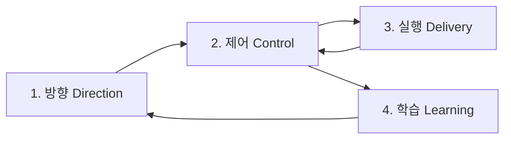

# 파이프라인 계약

이 문서는 `loop-vN` 기준 문제 해결 파이프라인의 고수준 운영 계약을 정의한다.
이 문서는 특정 스킬에 의존하지 않으며, 어떤 실행 주체든 동일하게 적용된다.

## 문제 해결 파이프라인 그래프


## 루프 기반 운영 원칙
1. 모든 실행은 최신 `loop-vN`을 기준으로 한다.
2. 단계 전환은 실행 주체가 아니라 디렉터리 상태(존재/비어있음/갱신 시각)로 판단한다.
3. 각 단계는 전용 산출 디렉터리를 소유한다.
4. 파일명은 실행 주체 자율이지만, 산출물은 반드시 해당 단계 디렉터리에 저장한다.
5. 실행 주체가 달라도 입력/출력 계약은 동일하다.

## 파이프라인 단계 카탈로그
| 단계 ID | 파이프라인 단계 | 목적 | 단계 산출 디렉터리 | 이전 단계 필수 디렉터리 |
|---|---|---|---|---|
| `C1` | `Direction` | 문제 정의와 범위를 확정한다. | `.agile/loops/loop-vN/1-direction/` | 없음 |
| `C2` | `Control` | 상태/리스크를 관리하고 다음 단계를 결정한다. | `.agile/loops/loop-vN/2-control/` | `.agile/loops/loop-vN/1-direction/` |
| `C3` | `Delivery` | 설계/구현/검증을 수행한다. | `.agile/loops/loop-vN/3-delivery/` | `.agile/loops/loop-vN/2-control/` |
| `C4` | `Learning` | 회고와 다음 루프 전략을 확정한다. | `.agile/loops/loop-vN/4-learning/` | `.agile/loops/loop-vN/3-delivery/` |

## 단계 전환 규칙
1. `C1 -> C2`: `1-direction/` 디렉터리가 존재하고 비어있지 않으면 전환한다.
2. `C2 -> C3`: `2-control/` 디렉터리가 존재하고 비어있지 않으면 전환한다.
3. `C3 -> C2`: `3-delivery/` 갱신 후 재평가가 필요하면 전환한다.
4. `C2 -> C4`: 제어 단계 산출물에서 학습 단계 진입 결정이 확인되면 전환한다.
5. `C4 -> C1`: `4-learning/` 산출물에서 다음 루프 시작 결정이 확인되면 전환한다.

## 산출물 관리 모델 (권장)
| 파이프라인 단계 | 산출 디렉터리 | 디렉터리 책임 | 최소 보장 조건 |
|---|---|---|---|
| `C1 Direction` | `1-direction/` | 문제 정의/범위 확정 관련 산출물 저장 | 디렉터리 존재 + 파일 1개 이상 |
| `C2 Control` | `2-control/` | 상태/리스크/라우팅 판단 관련 산출물 저장 | 디렉터리 존재 + 파일 1개 이상 |
| `C3 Delivery` | `3-delivery/` | 설계/구현/검증 실행 관련 산출물 저장 | 디렉터리 존재 + 파일 1개 이상 |
| `C4 Learning` | `4-learning/` | 회고/학습/다음 루프 전략 산출물 저장 | 디렉터리 존재 + 파일 1개 이상 |

운영 원칙:
1. 파일명 규칙은 강제하지 않는다.
2. 라우팅 판단은 단계 디렉터리 상태와 제어 단계 산출물의 결정 기록을 기준으로 한다.
3. 산출물은 반드시 현재 루프(`loop-vN`) 내부 디렉터리에 저장한다.

## 단계 실행 프로토콜
1. 최신 `loop-vN`을 식별한다.
2. 현재 단계와 이전 단계 디렉터리 상태를 점검한다.
3. 현재 단계 산출 디렉터리에 산출물을 생성/갱신한다.
4. 전환 조건 충족 여부를 확인하고 다음 단계로 이동한다.

## 게이트 체크리스트
1. 대상 루프가 최신 `loop-vN`인지 확인한다.
2. 이전 단계 필수 디렉터리가 존재하고 비어있지 않은지 확인한다.
3. 현재 단계 산출물이 올바른 단계 디렉터리에 저장되었는지 확인한다.
4. 다른 루프 경로에 산출물이 섞이지 않았는지 확인한다.
5. 전환 조건 충족 후에만 다음 단계로 라우팅한다.

## 라우팅 규칙
1. `1-direction/`이 없거나 비어있으면 `C1(Direction)`으로 라우팅한다.
2. `2-control/`이 없거나 비어있으면 `C2(Control)`로 라우팅한다.
3. `3-delivery/`가 없거나 실행 진행 중이면 `C3(Delivery)`로 라우팅한다.
4. 실행 후 재평가가 필요하면 `C2(Control)`로 라우팅한다.
5. `4-learning/`이 없고 학습 조건이 충족되면 `C4(Learning)`으로 라우팅한다.
6. 학습 단계 종료 후 다음 루프 시작점으로 `C1(Direction)`에 재진입한다.

## 장애 및 복구
| 장애/불일치 | 감지 위치 | 복구 규칙 | 재진입 단계 |
|---|---|---|---|
| 필수 입력 디렉터리 누락 | 모든 단계 게이트 | 누락 디렉터리를 채우는 직전 단계로 회귀 | 직전 단계 |
| 단계 디렉터리 비어 있음 | 모든 단계 게이트 | 해당 단계 산출물 최소 1개 생성 후 재평가 | 해당 단계 |
| `loop-vN` 경로 불일치 | 모든 단계 | 최신 루프 기준으로 산출물 재배치 후 경로 정리 | `C2(Control)` |
| 잘못된 단계 디렉터리에 산출물 저장 | 모든 단계 | 올바른 단계 디렉터리로 이동/재기록 | 해당 단계 |

## 준수 규칙
1. 모든 실행 주체는 본 문서의 디렉터리 계약을 준수한다.
2. 실행 주체는 특정 스킬명 의존 없이 입력/출력 계약을 충족해야 한다.
3. 단계 전환 판단은 파일명/구현체가 아니라 디렉터리 상태 기준으로 수행한다.
4. `다음 단계` 결정은 `라우팅 규칙`과 충돌하면 안 된다.

## 산출물 저장 경로
```text
.agile/
└─ loops/
   └─ loop-vN/
      ├─ 1-direction/
      ├─ 2-control/
      ├─ 3-delivery/
      └─ 4-learning/
```

## 변경 이력
- `v1.5.1` (2026-03-04): 단계 산출 경로에서 `details/` 중간 디렉터리를 제거하고 `loop-vN` 바로 아래 단계 디렉터리 구조로 단순화함.
- `v1.5.0` (2026-03-04): 단계별 `.md` 산출 문서 개념을 제거하고, `details/1-direction~4-learning` 디렉터리 기반 계약으로 전환함.
- `v1.4.3` (2026-03-04): 상세 산출물 묶음과 저장 경로 표기를 `1-direction/2-control/3-delivery/4-learning` 형식으로 통일함.
