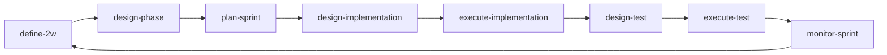

# 메인 8개 스킬 운영 문서

이 문서는 스킬을 수정/추가하기 전에 기준점으로 삼는 운영 문서다.
변경 제안은 이 문서 기준으로 브레인스토밍한 뒤 반영한다.
레거시 스킬 매핑/전환 기준은 `docs/operations/skills-lifecycle.md`를 참고한다.

## 운영 흐름


## 스킬별 1줄 설명
- `define-2w`: 사용자 입력에서 What/Why를 도출해 2W를 확정한다.
- `design-phase`: 2W 기반으로 Phase/US/지표를 설계한다.
- `plan-sprint`: 스프린트 계획/상태/회고 문서를 운영한다.
- `design-implementation`: 구현 범위/다이어그램/인터페이스/ADR을 설계한다.
- `execute-implementation`: 구현 코드를 작성하고 결과를 US 단위로 문서화한다.
- `design-test`: 테스트 케이스와 우선순위를 설계한다.
- `execute-test`: 테스트를 실행하고 실패 분석/재검증을 기록한다.
- `monitor-sprint`: 현재 스프린트 진행률/일정 상태를 시각화한다.

## 산출물 저장 경로 (통합 트리)
```text
.agile/
├─ context/
│  └─ tech-stack.md
└─ loops/
   └─ loop-vN/
      ├─ define-2w.md
      ├─ define-2w-case-study.md
      ├─ design-phase.md
      ├─ design-implementation.md
      ├─ execute-implementation-us-N.M.md
      ├─ design-test-us-N.M.md
      ├─ execute-test-us-N.M.md
      └─ sprint/
         ├─ sprint-plan.md
         ├─ sprint-status.md
         ├─ us-N.M-retrospective.md
         └─ sprint-retrospective.md
```

참고:
- `monitor-sprint`는 조회형 스킬이며 별도 산출물 파일을 생성하지 않는다.

## 변경 제안 체크리스트
| 점검 항목 | 확인 | 메모 |
|---|---|---|
| 제안 목적이 `What/Why 우선` 원칙과 충돌하지 않는가? | [ ] |  |
| 제안 스킬의 책임이 프로젝트 설계(`define-2w`, `design-phase`) 또는 스프린트 운영(`plan-sprint`, `design-implementation`, `execute-implementation`, `design-test`, `execute-test`, `monitor-sprint`) 중 어디인지 명확한가? | [ ] |  |
| 기존 스킬과 역할이 겹치지 않고 경계가 명확한가? | [ ] |  |
| 입력/출력 산출물 경로가 `.agile/loops/loop-vN/` 규칙을 따르는가? | [ ] |  |
| 산출물 파일명이 스킬명/역할과 일관되고 의미가 명확한가? | [ ] |  |
| 사용자 확인 게이트가 필요한 단계인지, 필요 시 질문이 최소화되어 있는가? | [ ] |  |
| 사례 연구/웹 검색이 필요한 경우 실행 조건과 최대 범위(비용/토큰)가 정의되어 있는가? | [ ] |  |
| 문서 템플릿 변경 시 관련 스킬 `SKILL.md`와 참조 문서 경로가 함께 갱신되는가? | [ ] |  |
| 기존 프로젝트와의 호환(레거시 파일명/경로 처리)이 필요한지 검토했는가? | [ ] |  |
| 변경 후 운영 흐름(2W -> Phase -> Sprint 루프)이 끊기지 않는가? | [ ] |  |
