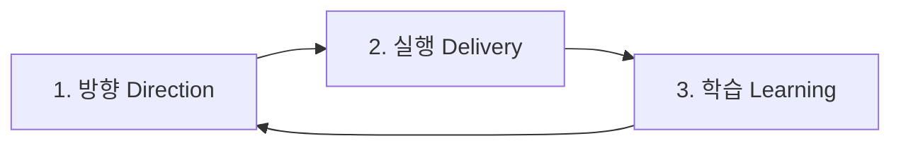

# 문제 해결 프레임워크

이 문서는 `sprint-N` 기준 문제 해결 파이프라인의 고수준 운영 계약을 정의한다.
이 문서는 특정 스킬에 의존하지 않으며, 어떤 실행 주체든 동일하게 적용된다.

## 상위 원칙 문서
- 프레임워크 공통 실행 원칙은 `docs/skill-ops/principles.md`를 따른다.
- 본 문서는 단계 게이트/라우팅/산출물 계약을 정의하며, 원칙 문서는 실행 태도/판단 기준을 정의한다.
- 문서 간 충돌 시 디렉터리/게이트/라우팅 계약은 본 문서를 우선 적용한다.

## 변화 개방성 원칙
1. 프레임워크/스킬/프로젝트 산출물은 고정 규약이 아니라 실행과 학습으로 지속 개정되는 운영 자산이다.
2. 변하지 않음은 완전함의 증거가 아니며, 반복 마찰이 발생할 때는 도태 위험 신호로 간주한다.
3. 운영 규칙 변경은 증적(실행 결과, 리스크 로그, 회고 결과) 기반으로 수행하고 변경 이력에 남긴다.

## 문제 해결 파이프라인 그래프


## 스프린트 기반 운영 원칙
1. 모든 실행은 최신 `sprint-N`을 기준으로 한다.
2. 단계 전환은 단계 산출 디렉터리 상태(존재/비어있음/갱신 여부)로 판단한다.
3. 각 단계는 전용 산출 디렉터리를 소유한다.
4. 파일명은 실행 주체 자율이지만, 산출물은 반드시 해당 단계 디렉터리에 저장한다.
5. 다음 적용 스킬 선택은 `framework-applied-skills.md`의 적용 순서를 기준으로 한다.
6. 새 `sprint-N` 시작 전에는 해당 스프린트 전용 작업 브랜치를 생성/전환해야 한다.

## 시동 규칙 (Bootstrap)
1. Bootstrap은 단계(`C1/C2/C3`)가 아닌 준비 작업이다.
2. 대상 스프린트 디렉터리가 없으면 아래 구조를 먼저 생성한다.
3. Bootstrap은 디렉터리 준비만 수행하며, 다음 단계 의사결정을 수행하지 않는다.
4. 첫 사용자 경험 단계는 항상 `C1 Direction`에서 시작한다.
5. 스프린트 시작 시 브랜치 확보(생성/전환)는 `define-2w`의 브랜치 게이트에서 강제한다.

```text
.agile/
└─ sprints/
   └─ sprint-N/
      ├─ 1-direction/
      ├─ 2-delivery/
      └─ 3-learning/
```

## 파이프라인 단계 카탈로그
| 단계 ID | 파이프라인 단계 | 목적 | 단계 산출 디렉터리 | 이전 단계 필수 디렉터리 |
|---|---|---|---|---|
| `C1` | `Direction` | 문제 정의와 범위를 확정한다. | `.agile/sprints/sprint-N/1-direction/` | 없음 |
| `C2` | `Delivery` | 설계/구현/검증을 수행하고 진행 상태를 기록한다. | `.agile/sprints/sprint-N/2-delivery/` | `.agile/sprints/sprint-N/1-direction/` |
| `C3` | `Learning` | 회고와 다음 스프린트 전략을 확정한다. | `.agile/sprints/sprint-N/3-learning/` | `.agile/sprints/sprint-N/2-delivery/` |

## 단계 전환 규칙
1. `C1 -> C2`: `1-direction/` 디렉터리가 존재하고 비어있지 않으면 전환한다.
2. `C2 -> C3`: `2-delivery/` 디렉터리가 존재하고 비어있지 않으며 실행/검증 결과가 기록되면 전환한다.
3. `C3 -> C1`: `3-learning/` 디렉터리가 존재하고 비어있지 않으며 다음 스프린트 시작 결정이 기록되면 전환한다.
4. 전환 조건을 충족하지 못하면 현재 단계를 유지하고 산출물을 보강한다.

## Sprint Done 조건
1. `2-delivery/`에 실행/검증 산출물이 존재해야 한다.
2. `3-learning/`에 Sprint 회고와 학습 전략이 기록되어야 한다.
3. 다음 스프린트 시작 또는 종료 결정이 `3-learning/`에 기록되어야 한다.

## 산출물 관리 모델 (권장)
| 파이프라인 단계 | 산출 디렉터리 | 디렉터리 책임 | 최소 보장 조건 |
|---|---|---|---|
| `C1 Direction` | `1-direction/` | 문제 정의/범위 확정 관련 산출물 저장 | 디렉터리 존재 + 파일 1개 이상 |
| `C2 Delivery` | `2-delivery/` | 설계/구현/검증/진행 모니터링 산출물 저장 | 디렉터리 존재 + 파일 1개 이상 |
| `C3 Learning` | `3-learning/` | 회고/학습/다음 스프린트 전략 산출물 저장 | 디렉터리 존재 + 파일 1개 이상 |

운영 원칙:
1. 파일명 규칙은 강제하지 않는다.
2. 라우팅 판단은 단계 디렉터리 상태와 최근 산출물 기록을 기준으로 한다.
3. 산출물은 반드시 현재 스프린트(`sprint-N`) 내부 디렉터리에 저장한다.

## 단계 실행 프로토콜
1. 최신 `sprint-N`을 식별한다.
2. 스프린트 시작 지점에서는 `define-2w` 브랜치 게이트로 작업 브랜치를 확보한다.
3. 스프린트 디렉터리가 없으면 Bootstrap을 수행한다.
4. 현재 단계와 이전 단계 디렉터리 상태를 점검한다.
5. 현재 단계 산출 디렉터리에 산출물을 생성/갱신한다.
6. 전환 조건 충족 여부를 확인하고 다음 단계로 이동한다.

## 게이트 체크리스트
1. 대상 스프린트가 최신 `sprint-N`인지 확인한다.
2. 이전 단계 필수 디렉터리가 존재하고 비어있지 않은지 확인한다.
3. 현재 단계 산출물이 올바른 단계 디렉터리에 저장되었는지 확인한다.
4. 다른 스프린트 경로에 산출물이 섞이지 않았는지 확인한다.
5. 현재 작업 브랜치가 대상 `sprint-N`과 정합한지 확인한다.
6. 전환 조건 충족 후에만 다음 단계로 라우팅한다.

## 라우팅 규칙
1. 대상 스프린트 디렉터리가 없으면 Bootstrap을 수행한다.
2. `1-direction/`이 없거나 비어있으면 `C1(Direction)`으로 라우팅한다.
3. `2-delivery/`가 없거나 실행 진행 중이면 `C2(Delivery)`로 라우팅한다.
4. `3-learning/`이 없고 실행/검증이 완료되면 `C3(Learning)`으로 라우팅한다.
5. `3-learning/` 산출 완료 시 다음 스프린트 `C1(Direction)`으로 재진입한다.

## 장애 및 복구
| 장애/불일치 | 감지 위치 | 복구 규칙 | 재진입 단계 |
|---|---|---|---|
| 스프린트 디렉터리 누락 | 실행 시작 시 | Bootstrap 수행 후 단계 재판단 | `C1(Direction)` |
| 필수 입력 디렉터리 누락 | 모든 단계 게이트 | 누락 디렉터리를 채우는 직전 단계로 회귀 | 직전 단계 |
| 단계 디렉터리 비어 있음 | 모든 단계 게이트 | 해당 단계 산출물 최소 1개 생성 후 재평가 | 해당 단계 |
| `sprint-N` 경로 불일치 | 모든 단계 | 최신 스프린트 기준으로 산출물 재배치 후 경로 정리 | 해당 단계 |
| 브랜치-스프린트 불일치 | 모든 단계 게이트 | 작업 중단(HOLD) 후 `define-2w` 브랜치 게이트로 회귀 | `C1(Direction)` |
| 잘못된 단계 디렉터리에 산출물 저장 | 모든 단계 | 올바른 단계 디렉터리로 이동/재기록 | 해당 단계 |

## 준수 규칙
1. 모든 실행 주체는 본 문서의 디렉터리 계약을 준수한다.
2. 실행 주체는 특정 스킬명 의존 없이 입력/출력 계약을 충족해야 한다.
3. Bootstrap은 스프린트 디렉터리 준비 작업이며 단계 전환 의사결정을 대체하지 않는다.
4. `다음 단계` 결정은 `framework-applied-skills.md`의 적용 순서와 충돌하면 안 된다.
5. 브랜치 생성/전환은 `define-2w`에서 1회 강제하고, 이후 단계는 정합성 검증만 수행한다.
6. 반복적인 예외/마찰/환경 변화가 확인되면 기존 규칙 고정보다 프레임워크 개정을 우선 검토한다.

## 변경 이력
- `v2.4.0` (2026-03-05): 변화 개방성 원칙을 추가하고, 반복 마찰/환경 변화 시 프레임워크 개정을 우선 검토하도록 준수 규칙을 보강함.
- `v2.3.0` (2026-03-05): 새 스프린트 시작 전 전용 브랜치 확보 규칙을 추가하고, 브랜치-스프린트 불일치 시 `define-2w` 브랜치 게이트로 HOLD 회귀하도록 정의함.
- `v2.2.0` (2026-03-05): 상위 원칙 문서를 `docs/skill-ops/principles.md`로 분리하고 프레임워크에서 참조하도록 정리함.
- `v2.1.0` (2026-03-05): `Control` 단계를 제거하고 `Delivery`/`Learning` 책임을 분리하는 3단계 운영 기준을 확정함.
- `v2.0.0` (2026-03-05): 단계 모델을 `Direction/Delivery/Learning` 3단계로 단순화하고, `Bootstrap` 시동 규칙을 추가했으며 단계 산출 경로를 `1-direction/2-delivery/3-learning`으로 재정의함.
