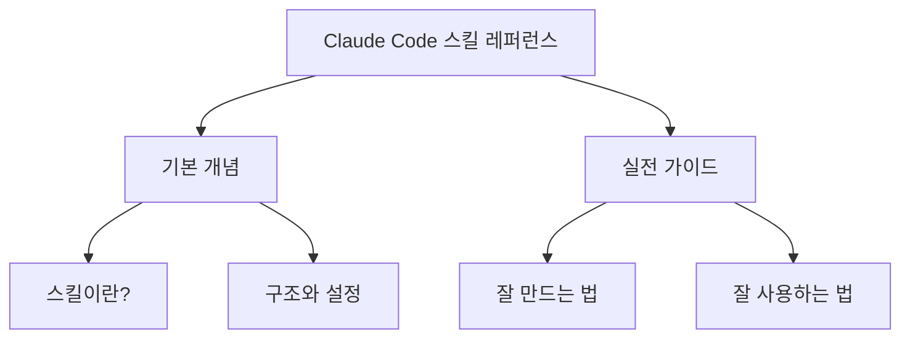
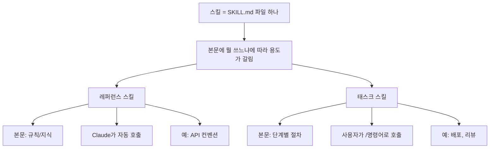
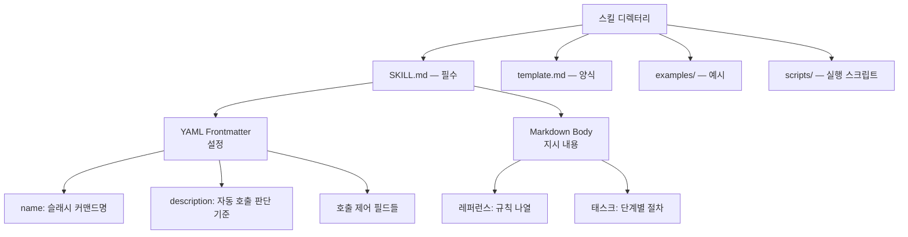
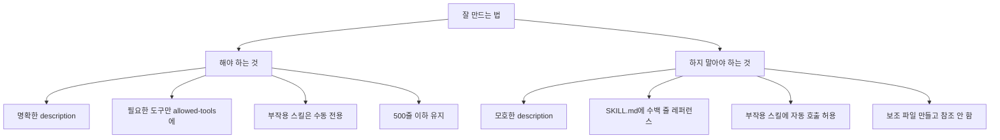
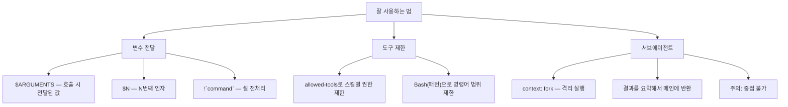

# Claude Code 스킬 레퍼런스

> 이 문서는 Claude Code 스킬의 기본 개념과 실전 가이드를 정리한 것이다.
> 처음 스킬을 만드는 사람은 위에서부터 읽고, 이미 아는 사람은 필요한 섹션으로 점프한다.



| 덩어리 | 대상 독자 |
|--------|----------|
| **기본 개념 — 스킬이란?** | 처음 만드는 본인 |
| **기본 개념 — 구조와 설정** | 처음 만드는 본인 |
| **실전 가이드 — 잘 만드는 법** | 미래의 본인 |
| **실전 가이드 — 잘 사용하는 법** | 미래의 본인 |

---

## 기본 개념 — 스킬이란?



스킬은 Claude Code의 기능을 확장하는 단위다. `SKILL.md` 파일 하나가 곧 스킬 하나이며, [Agent Skills](https://agentskills.io) 오픈 표준을 따른다.

**두 유형의 차이는 본문의 내용이 결정한다:**

| | 레퍼런스 스킬 | 태스크 스킬 |
|---|---|---|
| **본문** | 규칙, 컨벤션, 지식 | 단계별 워크플로우 |
| **호출** | Claude가 description 보고 자동 판단 | 사용자가 `/명령어`로 직접 |
| **결과** | 응답에 규칙이 녹아들어감 | 단계를 순서대로 실행 |
| **예시** | API 작성 컨벤션, 코딩 스타일 | 배포, PR 리뷰, 평가 |

**자동 호출의 원리:**

"자동 적용"은 마법이 아니라 Claude의 판단에 의한 로드다.

1. 세션 시작 → 모든 스킬의 `name` + `description`만 컨텍스트에 로드 (본문은 아직 안 읽음)
2. 사용자가 대화 → Claude가 description을 보고 매칭 판단
3. 매칭되면 → 해당 SKILL.md 본문 전체를 로드
4. 본문의 규칙을 따라 응답

따라서 **description의 품질이 곧 자동 호출의 정확도**다. 모호하면 엉뚱한 상황에서 호출되거나 필요할 때 호출되지 않는다.

---

## 기본 개념 — 구조와 설정



**SKILL.md는 두 부분으로 구성된다:**

```yaml
---
# YAML Frontmatter (설정)
name: my-skill
description: 스킬이 하는 일과 사용 시점
---

# Markdown Body (지시 내용)
Claude가 따라야 할 지시사항...
```

**핵심 frontmatter 필드:**

| 필드 | 역할 | 기본값 |
|------|------|--------|
| `name` | 슬래시 커맨드명. 소문자+숫자+하이픈, 최대 64자 | 디렉터리명 |
| `description` | Claude의 자동 호출 판단에 사용. **가장 중요한 필드** | 본문 첫 단락 |
| `disable-model-invocation` | `true`면 자동 호출 차단 (수동 전용) | `false` |
| `user-invocable` | `false`면 `/` 메뉴에서 숨김 | `true` |

**보조 파일 — SKILL.md만으로 부족할 때:**

보조 파일은 모두 선택사항이다. SKILL.md를 500줄 이하로 유지하면서 필요할 때만 Claude가 Read로 로드하는 것이 목적이다.

| 파일 | 용도 | 예시 |
|------|------|------|
| `template.md` | "이 양식대로 채워" — 구조화된 결과물의 틀 | PR 양식, 평가 결과 양식 |
| `examples/` | "이런 느낌으로 만들어" — 완성된 산출물 예시 | 톤/분량/포맷 샘플 |
| `scripts/` | "이건 직접 실행해" — Bash로 실행하는 스크립트 | 데이터 가공, 검증 |

보조 파일은 자동 로드되지 않으므로, **SKILL.md에서 명시적으로 참조**해야 한다.

---

## 실전 가이드 — 잘 만드는 법



**해야 하는 것:**

- **명확한 description**: 무엇을, 언제, 왜 사용하는지 구체적으로. 이것이 자동 호출 정확도를 결정한다.
- **적절한 도구 스코프**: 필요한 도구만 `allowed-tools`에 지정.
- **부작용 스킬에 수동 전용 설정**: 배포, 전송 등은 `disable-model-invocation: true`로 Claude가 임의 실행하지 못하게.
- **500줄 이하 유지**: 초과하면 보조 파일로 분리.
- **보조 파일 참조 명시**: SKILL.md에서 보조 파일의 존재와 용도를 언급해야 Claude가 인지한다.

**하지 말아야 하는 것:**

| 안티패턴 | 왜 문제인가 |
|----------|------------|
| 모호한 description (`"코드 도움"`) | 거의 모든 상황에서 호출되거나 아예 안 됨 |
| SKILL.md에 수백 줄 레퍼런스 | 컨텍스트 낭비, 가독성 저하 |
| 부작용 스킬에 자동 호출 허용 | Claude가 예기치 않게 배포/전송 실행 |
| 보조 파일을 만들고 참조 안 함 | Claude가 보조 파일 존재를 모름 |
| `user-invocable: false`를 보안 수단으로 사용 | 메뉴에서만 숨길 뿐, Claude는 여전히 호출 가능 |

**평가 체크리스트 (빠른 참고용):**

- [ ] `SKILL.md`가 `.claude/skills/<name>/SKILL.md`에 있는가?
- [ ] frontmatter 문법이 올바른가? (`---`로 감싸짐)
- [ ] `description`이 구체적이고 용도를 명확히 설명하는가?
- [ ] `allowed-tools`가 필요한 도구만 포함하는가?
- [ ] 부작용 스킬에 `disable-model-invocation: true`가 있는가?
- [ ] 500줄 이하인가?
- [ ] 보조 파일이 있으면 SKILL.md에서 참조하는가?
- [ ] 프로젝트의 기존 패턴/철학과 일관성이 있는가?

---

## 실전 가이드 — 잘 사용하는 법



**변수 전달 — 스킬에 데이터 넘기기:**

`/fix-issue 123` 실행 시 본문의 `$ARGUMENTS`가 `123`으로 치환된다.

| 변수 | 설명 |
|------|------|
| `$ARGUMENTS` | 호출 시 전달된 모든 인자 |
| `$N` | N번째 인자 (0부터) |
| `${CLAUDE_SESSION_ID}` | 현재 세션 ID |
| `` !`command` `` | 셸 전처리: 스킬 로드 전에 실행, 결과로 치환 |

`$ARGUMENTS`가 본문에 없으면 끝에 `ARGUMENTS: <값>`이 자동 추가된다.

**도구 제한 — 스킬별 권한 관리:**

```yaml
allowed-tools: Read, Grep, Bash(gh *)
```

`Bash(python *)` 같은 패턴 제한도 가능하다.

**서브에이전트 — 격리된 실행 환경:**

```yaml
context: fork
agent: Explore
```

- 격리된 컨텍스트에서 실행되어 메인 대화 히스토리에 접근하지 않는다.
- 결과를 요약해서 메인 대화에 반환한다.
- **주의 사항**: 태스크 지시 없이 레퍼런스만 있으면 의미 있는 출력이 없다. 중첩 생성도 불가하다.

**호출 제어 요약:**

| 설정 | 사용자 호출 | Claude 자동 호출 |
|------|-----------|-----------------|
| 기본값 | O | O |
| `disable-model-invocation: true` | O | X |
| `user-invocable: false` | X | O |
